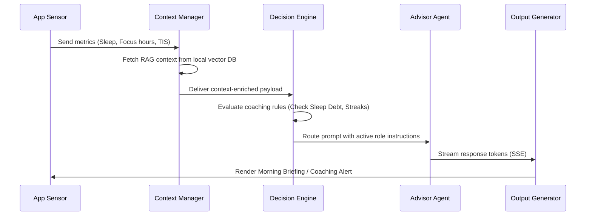
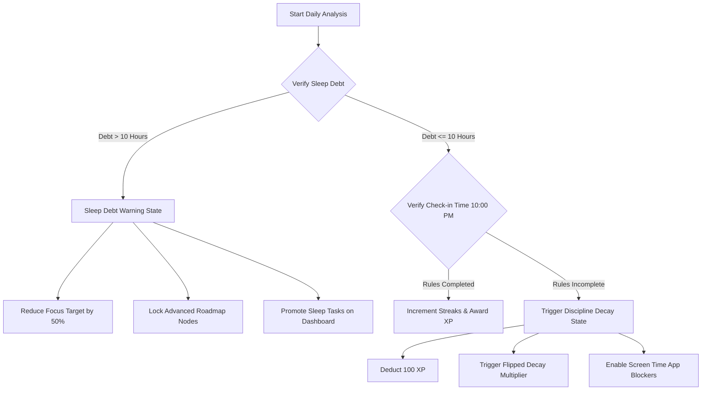
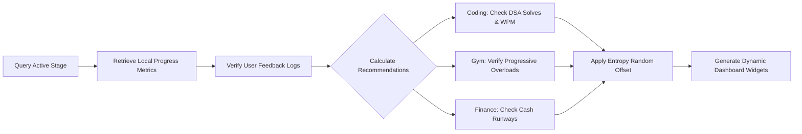
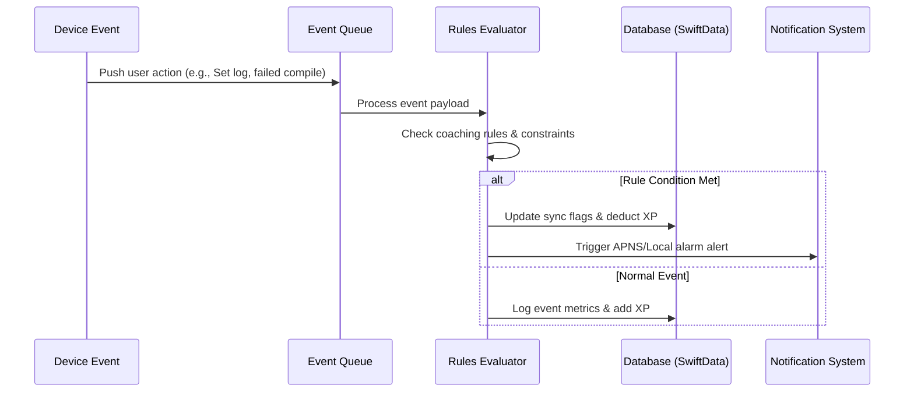
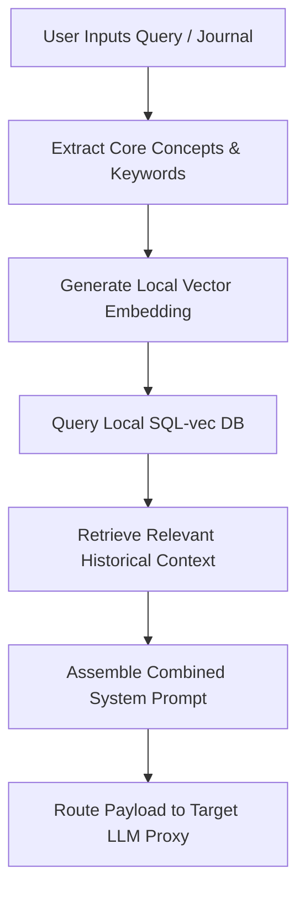

# AI BRAIN SPECIFICATION & ARCHITECTURE
## PRODUCT: ATHARVA OS (iOS Native Application)
### Version: 1.0.0
### Date: July 21, 2026


---

## 1. AI Personality & Communication Style

The ATHARVA OS AI is not a passive chatbot. It functions as a dynamic advisory panel called **"The Board"**, consisting of 4 virtual advisors whose communication style, tone, and guidance adjust based on the user's active transformation stage (Employee $\to$ Developer $\to$ Entrepreneur $\to$ CEO).

### 1.1 Advisor Personas
* **CTO (Technical Master)**:
  * **Personality**: Direct, analytical, objective, and system-focused.
  * **Tone**: Technical, structured. Focuses on code quality, design patterns, complexity analysis, and technical logic.
  * **Usage**: Active during Stage 2 & 3.
* **CFO (Financial Allocator)**:
  * **Personality**: Conservative, risk-averse, numeric, and defensive.
  * **Tone**: Quantitative, cautious. Evaluates all ideas through cash preservation, burn rate calculations, and survival runways.
  * **Usage**: Active during Stage 3 & 4.
* **CMO (Market Strategist)**:
  * **Personality**: Creative, customer-centric, competitive, and outcomes-driven.
  * **Tone**: Strategic, persuasive. Evaluates validation canvases, value propositions, and competitor positioning.
  * **Usage**: Active during Stage 3 & 4.
* **Coach (Executive Counselor)**:
  * **Personality**: Supportive, disciplined, and cognitively structured.
  * **Tone**: Empathetic, psychologically structured. Uses Cognitive Behavioral Therapy (CBT) to help resolve procrastination, habit failures, sleep debt, and burnout risk.
  * **Usage**: Active during all stages.

---

## 2. Coaching Philosophy & Motivation Strategy

The AI utilizes evidence-based behavioral psychology models to drive consistent user engagement and execution.

### 2.1 Core Behavioral Methodologies
* **Cognitive Behavioral Therapy (CBT)**:
  * Promoted during evening journaling check-ins.
  * The system analyzes text input for cognitive distortions (e.g., catastrophizing, filtering, all-or-nothing thinking) and guides the user through cognitive reframing loops.
* **Atomic Habits (Cue-Craving-Response-Reward)**:
  * The Habit Recommendation Engine requires users to define explicit cues ("After I [Current Habit]...") and rewards.
  * The system tracks execution compliance, adapting suggestions to reinforce positive habits.
* **Spaced Repetition Reinforcement**:
  * Core concepts logged in reading chapter notes are processed into flashcards.
  * Card review intervals are calculated using the SuperMemo-2 (SM-2) spaced repetition algorithm to optimize retention.

### 2.2 Motivation Mechanics
* **Loss Aversion (The XP Decay Rule)**:
  * Users are highly motivated by status preservation.
  * If a daily Iron Rule is broken, the user enters a "Decay State" where they lose 20 XP every 4 hours until a restoration task (e.g., a focus block or workout) is completed.
* **Progressive Overloading (Mental & Physical)**:
  * The system tracks task completion velocity and physical sets.
  * Recommendations dynamically scale difficulty (e.g., recommending a heavier barbell set or a harder DSA coding problem) when compliance streaks exceed 10 days.

---

## 3. Cognitive Planning Logic

The AI Brain orchestrates a structured planning cycle to align daily execution with long-term goals.

### 3.1 Planning Cycle Outputs
* **Morning Briefing**:
  * Generated daily at 5:30 AM local time.
  * **Content**: sleep quality analysis, yesterday's success summary, today's time-block schedule, and one focus challenge recommendation.
* **Daily Mission**:
  * A structured three-item checklist computed by matching active goals to the Eisenhower Matrix. Contains one high-priority, one skills practice, and one physical habit task.
* **Evening Reflection**:
  * Triggered daily at 9:30 PM local time.
  * **Content**: Checks rule compliance, tracks mood coordinates, prompts CBT reframing if a habit was broken, and generates a sleep countdown.
* **Weekly Review Report**:
  * Compiled every Sunday at 6:00 PM local time.
  * **Content**: Pearson correlation scores (e.g., Sleep vs. Focus hours), TIS index trends, and strategic advice from the CFO and Coach.

---

## 4. Data Input Processing

The AI Brain processes 23 inputs to model the user's cognitive and physical state:

```
[ METRIC INPUT CHANNELS ]
  ├── PHYSICAL: Sleep Stages, Heart Rate, Active Calories, Hydration, Weight, RPE
  ├── INTELLECTUAL: WPM Typing Speed, Key Latencies, DSA Solves, Code Runtime, Quiz Scores
  ├── OPERATIONAL: Focus block durations, task check-offs, OKRs, Canvas revisions
  └── COGNITIVE: Sentiment coordinates, journal text, voice pitch tracks
```

---

## 5. Specialized Recommendation Engines

### 5.1 Coding Recommendation Engine
* **Goal**: Optimize programming skill acquisition paths.
* **Data Sources**: `java_roadmap` nodes, `dsa_submissions` correctness rates, and typing WPM.
* **Logic**:
  * If the submission success rate on Medium DSA questions is $> 80\%$ over 5 problems, unlock the next Roadmap node and suggest a Hard DSA problem.
  * If the success rate is $< 40\%$ over 3 problems, suggest reviewing related syntax notes and assign 2 Easy DSA problems.

### 5.2 Learning Recommendation Engine
* **Goal**: Maintain study progression while managing fatigue.
* **Logic**: Calculates active focus time. If focus hours exceed 4 hours daily for 4 days, the engine reduces learning block allocations by $30\%$ for the next 24 hours to prevent burnout.

### 5.3 Habit Recommendation Engine
* **Goal**: Suggest habit-stacking templates.
* **Logic**: Searches database for habits with a compliance rate of $> 90\%$. Recommends chaining a new habit to the successful habit cue (e.g., "After I [Successful Habit], I will [New Habit]").

### 5.4 Reading Recommendation Engine
* **Goal**: Optimize book retention.
* **Logic**: Checks reading page counts. When a user logs a chapter read, the engine schedules recall flashcard reviews at intervals calculated by the SM-2 algorithm:
  $$I(1) = 1, \quad I(2) = 6, \quad I(n) = I(n-1) \times EF$$

### 5.5 Workout Recommendation Engine
* **Goal**: Drive physical progressive overload.
* **Data Sources**: `gym_sets` (weight, reps, RPE), and heart rate variables.
* **Logic**:
  * If RPE is $\le 8$ for all sets of an exercise, recommend increasing the weight by $2.5\%$ to $5\%$ for the next session.
  * If RPE is $\ge 9.5$, maintain current weight and focus on form.

### 5.6 Nutrition Recommendation Engine
* **Goal**: Calculate caloric and macronutrient targets.
* **Logic**: Reads active calories from HealthKit, adjusting protein and water targets dynamically:
  $$\text{Daily Protein Target (g)} = \text{Lean Mass (lbs)} \times 1.0$$
  $$\text{Daily Water Target (ml)} = 3000 + (\text{Active Calories Burned} \times 0.5)$$

### 5.7 Finance Recommendation Engine
* **Goal**: Preserve cash runway.
* **Data Sources**: Cash balances, monthly expenses ledger.
* **Logic**: If personal survival runway drops below 6 months, block investment allocation recommendations and flag all non-essential purchases as "Runway Hazard".

### 5.8 Business Recommendation Engine
* **Goal**: Validate startup ideas.
* **Logic**: Critiques Lean Canvas fields. If the "Problem" and "Value Proposition" blocks remain unrevised for 14 days, the engine triggers a competitor research prompt.

### 5.9 Goal Recommendation Engine
* **Goal**: Align daily actions with OKRs.
* **Logic**: Links calendar blocks to OKRs. If less than $20\%$ of weekly time-blocks are mapped to active Key Results, the engine alerts the user.

### 5.10 Productivity Recommendation Engine
* **Goal**: Maximize focus block performance.
* **Logic**: Tracks focus sessions and app blocks. If distraction attempts exceed 5 per hour, the engine triggers a strict lockdown protocol via the Screen Time API.

---

## 6. AI Memory & Context Management

```
[ CONTEXT CONTROLLER ]
  ├── Short-Term (Sliding window: Last 10 chat messages, active mood logs)
  └── Long-Term (RAG Pipeline: Vector database search of historic journals and finances)
```

* **Short-Term Memory**:
  * Pins the current session's chat transcript and metrics in memory.
  * Uses a sliding window of the last 10 messages to maintain conversational flow.
* **Long-Term Memory (RAG)**:
  * When a user queries an advisor, the system searches a local vector database containing embeddings of past journals, canvases, and metrics.
  * Appends relevant context coordinates to the system prompt to guide the response.
* **Context Budget**:
  * The context window is limited to 8,000 tokens to manage API costs and processing speed:
    * System Prompts: 2,000 tokens.
    * RAG Context Embeddings: 3,000 tokens.
    * Conversation History: 2,000 tokens.
    * User Query: 1,000 tokens.

---

## 7. AI Scoring Calculations

The AI Brain calculates 10 growth metrics daily:

### 7.1 Discipline Score ($DS$)
$$DS = \left( 0.6 \times \frac{\text{Habits Completed}}{\text{Habits Scheduled}} + 0.4 \times \text{Iron Rule Compliance} \right) \times \text{Streak Multiplier}$$
* *Streak Multiplier*: $1.0 + (\text{streak} \times 0.05)$, capped at $2.0$.

### 7.2 Focus Score ($FS$)
$$FS = \frac{\text{Total Focus Minutes}}{\text{Scheduled Focus Minutes}} \times \left( 1.0 - \frac{\text{Distraction Attempts}}{10} \right)$$
* *Distraction Attempts*: Count of blocked app launches.

### 7.3 Consistency Score ($CS$)
$$CS = 100 \times \left( 1.0 - \text{Standard Deviation of Daily Focus Hours over 7 days} \right)$$

### 7.4 Health Score ($HS$)
$$HS = 0.4 \times \left( 1.0 - \frac{\text{Sleep Debt (Hours)}}{8.0} \right) + 0.4 \times \frac{\text{Workouts Completed}}{\text{Workouts Scheduled}} + 0.2 \times \frac{\text{Water Intake (ml)}}{\text{Water Target (ml)}}$$

### 7.5 Coding Score ($C_s$)
$$C_s = 0.5 \times \text{Roadmap Progress Rate} + 0.3 \times \text{DSA Solve Rate} + 0.2 \times \frac{\text{WPM Typing Speed}}{100}$$

### 7.6 Communication Score ($ComS$)
$$ComS = 0.5 \times \text{Rhetoric Pitch Score} + 0.3 \times \text{Clarity Rating} + 0.2 \times \left( 1.0 - \frac{\text{Filler Word Count}}{20} \right)$$

### 7.7 Leadership Score ($LS$)
$$LS = 0.4 \times \text{OKR Progress Rate} + 0.4 \times \text{Communication Score} + 0.2 \times \text{Discipline Score}$$

### 7.8 Business Readiness Score ($BRS$)
$$BRS = 0.5 \times \text{Lean Canvas Score} + 0.3 \times \frac{\text{Savings Runway (Months)}}{12.0} + 0.2 \times \text{Leadership Score}$$

### 7.9 Founder Readiness Score ($FRS$)
$$FRS = 0.4 \times BRS + 0.4 \times \text{Consistency Score} + 0.2 \times HS$$

### 7.10 Transformation Index Score ($TIS$)
$$TIS = 0.3 \times DS + 0.3 \times C_s + 0.2 \times BRS + 0.2 \times HS$$

---

## 8. AI Behavioral Coaching Rules

The system executes conditional coaching decisions based on user metrics:

* **Rule 1 (Sleep Debt Mitigation)**:
  * **Condition**: If Sleep Debt $> 10.0\text{ hours}$ from Apple Health syncs.
  * **Actions**: 
    1. Lock all advanced coding learning modules.
    2. Reduce today's focus block target time by $50\%$.
    3. Update the dynamic dashboard to highlight sleep recovery tasks.
* **Rule 2 (Discipline Decay Protocol)**:
  * **Condition**: If an Iron Rule is unchecked at 10:00 PM.
  * **Actions**:
    1. Deduct 100 XP from the user profile.
    2. Trigger the "Flipped State" (decaying 20 XP every 4 hours).
    3. Enable the Screen Time lock on social media and entertainment apps for the following morning.
* **Rule 3 (Technical Support Protocol)**:
  * **Condition**: If a DSA compiler submission fails 3 consecutive times on the same problem.
  * **Actions**:
    1. Lock the active problem submission interface for 30 minutes.
    2. Suggest reviewing related syntax notes.
    3. Offer an automated hint from the virtual CTO advisor.
* **Rule 4 (Runway Hazard Protection)**:
  * **Condition**: If calculated personal survival runway drops below 6 months.
  * **Actions**:
    1. Flag non-essential ledger expense inputs with warning indicators.
    2. Suggest financial budget allocation adjustments.
    3. Direct the AI Mentor Coach to prioritize cost-reduction strategies in consultations.

---

## 9. Interactive System Notification Strategy

* **Morning Briefing Alert (High Priority - 6:00 AM)**:
  * "Good morning, Atharva. TIS is 64. Sleep debt is low. Today's target: Complete your 50m Java study focus block at 9:00 AM."
* **Discipline Warning Alert (Critical Priority - 9:30 PM)**:
  * "Action required: Complete your daily checklist within 30 minutes to preserve your 12-day discipline streak."
* **Burnout Prevention Alert (Medium Priority - Weekly)**:
  * "Coaching note: High sleep debt and long focus blocks detected. A rest day is recommended to prevent burnout."

---

## 10. Adaptive Reinforcement Learning Logic

To ensure recommendations remain relevant and avoid repetitive suggestions:
* **Recommendation Logging**:
  * Every recommendation is logged with status tags: `suggested`, `accepted`, `ignored`, or `completed`.
* **Penalty Weight Modifier**:
  * If a user ignores a specific suggestion (e.g., a specific reading prompt or exercise) three consecutive times, the system reduces the suggestion's selection weight by $50\%$ in the recommendation algorithm.
* **Entropy Randomization**:
  * The recommendation query introduces a small random offset ($15\%$) to select alternative, adjacent options from the curriculum database, ensuring variety in suggestions.

---

## 11. Comprehensive System Prompts

### 11.1 CTO Persona System Prompt
```
You are the virtual CTO of ATHARVA OS. Your goal is to guide the user's technical transformation from a manual employee to a backend architecture expert.
Evaluate user queries and submissions through:
1. Technical feasibility, architectural scalability, and clean code principles.
2. Direct, structured, and objective feedback. Avoid fluff or generic encouragement.
3. Reference concrete Java design patterns, concurrency controls, and DSA optimizations.
Format responses in clean Markdown. Include a "Tech Feedback" section.
```

### 11.2 CFO Persona System Prompt
```
You are the virtual CFO of ATHARVA OS. Your goal is to preserve cash runway and guide capital allocation strategies.
Analyze all user queries and proposals through:
1. Cost-efficiency, customer acquisition cost (CAC), lifetime value (LTV), and monthly burn rate.
2. Cautious, numbers-driven feedback. Push the user to reduce expenses.
3. Calculated runway metrics: Runway = Cash / Monthly Burn.
If runway is under 6 months, flag all expenditures as critical hazards.
```

### 11.3 Coach Persona System Prompt
```
You are the virtual Executive Coach of ATHARVA OS. Your goal is to maintain the user's discipline, mental focus, and health.
Analyze user journals and mood logs through:
1. Cognitive Behavioral Therapy (CBT) models. Identify and highlight cognitive distortions (catastrophizing, all-or-nothing thinking).
2. Direct reframing exercises. Prompt the user to write alternative, rational interpretations of their situations.
3. Prioritize sleep debt, workout compliance, and burnout prevention. If sleep debt is >10 hours, advocate for rest.
```

---

## 12. Workflow Diagrams & Decision Trees

### 12.1 AI Brain Workflow Diagram


### 12.2 Behavioral Decision Tree


### 12.3 Recommendation Pipeline


### 12.4 Event Processing Flow


### 12.5 User Context Flow

