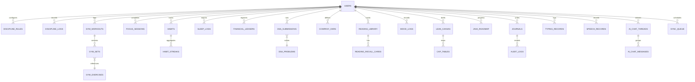

# DATABASE & DATA ARCHITECTURE SPECIFICATION
## PRODUCT: ATHARVA OS (iOS Native Application)
### Version: 1.0.0
### Date: July 21, 2026

---

## 1. Database Selection and Justification

### 1.1 Local Storage Engine (On-Device)
ATHARVA OS selects **SwiftData** layered over **SQLite** as its primary on-device local database framework. 
* **Justification**:
  * **Relational Support**: The application requires complex relational mapping (e.g., matching gym workout routines to individual progressive overload sets, linking daily cognitive performance directly to tracked sleep debt). SQLite provides full transactional safety (ACID compliance) and foreign key enforcement.
  * **System Performance**: SwiftUI compiles natively with SwiftData, enabling compiler-level validation of data schemas, automatic object context tracking, and direct binding to views.
  * **Low Memory Footprint**: CoreData/SwiftData dynamically loads objects into memory (lazy loading), keeping the app's baseline memory use below $150\text{MB}$ during standard executions.
  * **Encryption Capabilities**: Integrating SQLCipher at the SQLite layer allows complete, hardware-accelerated encryption of the database file at rest.

### 1.2 Cloud Synchronization Engine
The application uses the **iCloud CloudKit Private Database** partition as its remote synchronizer.
* **Justification**:
  * **Zero-Knowledge Security**: CloudKit private databases secure user data using keys held only by the user. Neither Apple nor third-party developers can decrypt user database tables on the server.
  * **Differential Sync**: Support for record zones allows the application to query only modifications made since the last synchronizer execution token.
  * **Native Integration**: SwiftData automatically manages container migrations and background updates to CloudKit without requiring intermediate API wrappers.

---

## 2. Complete Entity Relationship Diagram (ERD)

The data model maintains relational normalization to enforce references across modules:



---

## 3. Table Modeling Standards & Naming Conventions

* **Naming Conventions**:
  * **Table Names**: Snake-case, plural (e.g., `discipline_rules`, `dsa_submissions`).
  * **Column Names**: Snake-case, singular (e.g., `user_id`, `created_at`, `is_completed`).
  * **Primary Keys**: Explicitly named `id` and typed as `UUID` (universally unique identifier) on all tables to prevent primary key collisions during offline synchronization merge blocks.
  * **Foreign Keys**: Suffixed with `_id` and matching the target singular table name (e.g., `user_id` referencing table `users`).
  * **Timestamps**: Stored in ISO-8601 UTC format (`YYYY-MM-DD"T"HH:mm:ss.SSS"Z"`) mapped to the native Swift `Date` type.
* **Sync Fields**:
  * Every table must contain the following operational sync attributes:
    * `sync_state` (Integer: $0 = \text{Synced}$, $1 = \text{Pending Create}$, $2 = \text{Pending Update}$, $3 = \text{Pending Delete}$).
    * `vector_clock` (Integer: incremented locally with every modification).
    * `updated_at` (DateTime: UTC representation of the last database write).

---

## 4. Normalization & Denormalization Strategy

* **Normalization Standard**:
  * All transaction-dependent operational tables (e.g., `gym_sets`, `financial_ledgers`, `dsa_submissions`) are strictly normalized up to **Third Normal Form (3NF)**. This guarantees data consistency, prevents update anomalies, and makes sure delete operations propagate correctly.
* **Performance Denormalization**:
  * For analytical dashboards (e.g., the TIS progress metrics or weekly reports), reading nested relational models can be performance-heavy.
  * **Aggregate Caches**: The database maintains pre-calculated aggregates (e.g., `streak_count` in `habit_streaks`, `current_tis` in `users`, and `burn_rate` calculations). These fields are updated using database trigger equivalents inside the SwiftData lifecycle wrapper during table inserts.

---

## 5. Local Storage Strategy

* **Directory Setup**:
  * Database file is locked inside the Application Sandbox under `/Library/Application Support/` using the file name `AtharvaOS_DataV1.sqlite`.
* **Hardware-Accelerated Encryption (SQLCipher)**:
  * When SwiftData initializes, SQLCipher configures dynamic block encryption of the SQLite database.
  * Uses a 256-bit passphrase key derived using PBKDF2 with 100,000 salt iterations. The key is retrieved at runtime from the system Keychain.
* **Memory Management**:
  * Set `fetchLimit` configurations on dynamic list views. Auto-saving is configured to write context states to the SQLite disk on every 10 mutations or 60 seconds of background idle states.

---

## 6. Cloud Synchronization Strategy

The sync engine maps local SwiftData schemas to CloudKit private database records:

```
[ LOCAL SwiftData Context ] ──► [ Sync Queue Engine ] ──► [ CloudKit Private Zones ]
  - Checks sync_state             - Packages records        - Zero-knowledge storage
  - Tracks changes                - Differential updates    - differential token query
```

* **Data Zone Partitioning**:
  * Separate CloudKit Record Zones are defined for major security profiles:
    * `SystemConfigZone` (Settings, roadmaps - unencrypted on cloud).
    * `UserPrivateZone` (Habits, sleep, gym - standard cloud security).
    * `UserSecureZone` (Journals, finance, vault files - encrypted locally *before* transfer to CloudKit).
* **Differential Sync Logic**:
  * The system maintains an on-device `CKServerChangeToken`. On synchronization execution, it requests only changes that have occurred since the timestamp marked by this token, reducing sync payloads.

---

## 7. Conflict Resolution Strategy

When updates collide between the cloud and local databases:
1. **Clock Verification**: Compare the record's `vector_clock` values. The record with the higher clock number is saved.
2. **Timestamp Validation**: If `vector_clock` levels match, the system selects the database record with the more recent `updated_at` timestamp.
3. **Text Merging (Differential Patching)**: For text properties (e.g., journal entry bodies), the system executes a three-way diff merge. If conflicts cannot be resolved programmatically:
   * The server record is preserved.
   * The local record is written as a duplicate alternative draft named `[Original Title] - Conflict Copy` with `sync_state = 1`.
   * A local notification prompts the user to resolve the duplicate manually.

---

## 8. Soft Delete Strategy

To prevent records deleted on one device from re-syncing from the cloud:
* **Deletion Flag**: No row is immediately removed from SQLite disk tables via raw `DELETE` SQL commands.
* **Configuration**:
  * Set `is_deleted = true` and update the record’s sync state to `3 (Pending Delete)`.
  * The database engine filters query results to exclude soft-deleted records (`WHERE is_deleted = false`).
* **Purge Cleanup Pipeline**:
  * Once the sync queue successfully registers the deletion on the CloudKit server, a background SQLite vacuum process deletes the row from the local device after a 30-day grace period.

---

## 9. Audit Tables

Changes to high-priority tables (financial ledgers, journals, secure vault records) are recorded in the `audit_logs` table:
* **Log Rules**:
  * The log captures: `id` (PK), `table_name`, `record_id` (FK to modified entity), `action` (INSERT, UPDATE, DELETE), `changed_fields_json`, `vector_clock_before`, `vector_clock_after`, and `created_at`.
  * Audit logs are stored locally only and are excluded from standard cloud synchronization routines to prevent database bloat on the server.

---

## 10. Versioning & Model Migrations

* **Schema Versions**:
  * The database container is versioned with an integer identifier schema (initial schema version = `1`).
* **Migration Strategies**:
  * **Lightweight Migrations**: Adding nullable columns or columns with default value configurations is performed automatically by SwiftData at launch.
  * **Heavyweight Migrations**: If columns are renamed or relational mappings change, custom migration plans are run:
    ```
    - Lock database state.
    - Export active records to a temporary cache.
    - Drop and rebuild destination tables.
    - Transform and write cached records to the new table structure.
    - Update database schema version, release lock.
    ```

---

## 11. Backup and Restore Model

* **System Backups**:
  * The primary SQLite file is flagged for inclusion in native iOS iCloud backups, which are encrypted automatically by the OS.
* **Manual Encrypted Exports**:
  * The app allows users to export their database manually.
  * **Process**: Compresses the SQLite file and encrypts the ZIP package with AES-GCM-256 using a passcode provided by the user. The output file `AtharvaOS_Backup.avos` can be exported to iOS Files or saved to external storage.

---

## 12. Data Migration Strategy

* **Seeding System Defaults**:
  * First launch checks for database tables state. If empty, the system runs seed scripts to load:
    * Complete lists of static computer science items into the `dsa_problems` table.
    * The full Java curriculum tree structure into `java_roadmap`.
    * Master workout structures into `gym_exercises`.
* **Legacy Imports**:
  * Users can upload JSON data configurations from older versions of the app, which are verified against data validation rules before being written to the database.

---

## 13. Encryption Strategy for Sensitive Information

```
[ SENSITIVE ENTITY ] ──► [ AES-256-GCM Encryption ] ──► [ Secure SQLite Disk ]
  - Note, Journal, Finance       ▲
                                 │ (Retrieves Key)
                         [ Secure Enclave ] ──► [ iOS Keychain ]
```

* **Encryption Range**:
  * Selected fields (e.g., `ledger_note` in `financial_ledgers`, `journal_body` in `journals`, and all files in `secure_documents`) are encrypted *prior* to database write commands.
* **Key Lifecycle Management**:
  * A master key is generated on-device using a 256-bit secure random number generator.
  * This key is stored in the iOS Keychain under security flags requiring active device FaceID/TouchID verification to read.
  * Field data is encrypted using AES-GCM-256, writing the raw byte string to the database along with a 12-byte initialization vector (IV) and a 16-byte authentication tag.

---

## 14. Caching Strategy

To achieve 120Hz scrolling performance, the data model implements a three-tier caching system:
1. **SwiftData Context Cache**: Keeps active records in memory to allow rapid updates and reads.
2. **NSCache Layer**: Caches parsed image and media metadata reference details locally.
3. **Pre-Calculated Metrics Ledger**: Keeps aggregate statistics in memory to support swift updates to dashboard components.

---

## 15. Analytics Data Model

The analytics database maintains aggregate data matrices rather than raw event streams to preserve device storage limits:
* **Correlation Logs**: Tracks calculated daily totals like: `sleep_debt_hours`, `focus_work_minutes`, `dsa_success_rate`, `workout_rpe_average`, and `TIS_score`.
* **Database Target**: Keeps 90 days of logs on-device, running correlation calculations (like Pearson correlation coefficients) locally. Logs older than 90 days are summarized into monthly averages.

---

## 16. AI Context Storage Model

* **Chat Thread Architecture**:
  * Chats are structured inside the `ai_chat_messages` table, grouped by parent threads inside `ai_chat_threads`.
* **Vector Embeddings (On-Device)**:
  * Key journal notes and business canvas items are tokenized and processed locally using the `NaturalLanguage` framework.
  * The resulting vector coordinates are saved in a local SQLite-vec virtual database table (`vector_embeddings`) containing references to the source tables.
  * Allows the local AI Board to query semantic context details when answering user prompts.

---

## 17. File and Media Storage Model

* **Storage Paths**:
  * Large binary assets (such as voice note audio files and imported PDF documents) are not saved directly in the SQLite database rows to prevent database slowdowns.
  * **Implementation**: Files are saved to the application's local sandbox at `/Documents/SecureVault/` using naming conventions derived from unique SHA-256 hashes of the file contents.
  * The database tables record only path strings, metadata size details, and the file hashes.

---

## 18. Notification Data Model

Notifications are tracked inside the `notifications` table:
* **Components**: Registers alert states, delivery status, and priorities.
* **Smart Alert Queues**:
  * Low priority alert records are kept locally.
  * High-priority notifications schedule local system alarms (UNNotificationRequest) directly.
  * Keeps a 30-day transaction history on-device, removing older alerts during vacuum cleanups.

---

## 19. Offline-First Synchronization Model

```
               [ OFFLINE MODE OPERATION ]
               User makes change: Write locally
            Create record in `sync_queue` (sync_state = 1)
                           │
                 [ NETWORK RESTORED ]
                           │
       Query `sync_queue` WHERE sync_state != 0
                           │
    ┌──────────────────────┴──────────────────────┐
    ▼ (UPLOAD PROCESS)                            ▼ (DOWNLOAD PROCESS)
CloudKit push changes                        Query server updates (Token check)
Set sync_state = 0                           Resolve local collisions
                                             Clear sync_queue
```

---

## 20. Future Scalability Considerations

* **iPadOS & macOS Catalina Compatibility**:
  * SwiftData contexts are compatible across iPadOS and macOS Catalyst sandboxes. 
* **Backend Scale Integration**:
  * If the service expands to standard enterprise cloud platforms, the database models can migrate to remote systems:
    * The SQLite structures map to standard relational databases (PostgreSQL).
    * UUID primary key schemas allow scaling to distributed, multi-master backends without primary key conflicts.
* **Apple Watch Support**:
  * watchOS database updates use watch connectivity pipelines, sending lightweight transaction dictionaries directly to the iOS app database layer.

---

## 21. Table Directories

---

### T1: users
* **Purpose**: Tracks user profiles, current transformation stages, TIS progress, and calculated aggregates.
* **Columns**:
  * `id` (UUID, Primary Key, Not Null)
  * `display_name` (Text, Nullable)
  * `current_stage` (Integer, Default 1, Constraints: IN (1, 2, 3, 4))
  * `transformation_index_score` (Double, Default 0.0, Check: >= 0.0 AND <= 100.0)
  * `total_xp` (Integer, Default 0, Check: >= 0)
  * `strength_stat` (Integer, Default 1)
  * `intelligence_stat` (Integer, Default 1)
  * `charisma_stat` (Integer, Default 1)
  * `fortune_stat` (Integer, Default 1)
  * `created_at` (DateTime, Not Null)
  * `updated_at` (DateTime, Not Null)
  * `sync_state` (Integer, Default 1)
  * `vector_clock` (Integer, Default 1)
  * `is_deleted` (Boolean, Default false)
* **Relationships**:
  * One-to-Many with `discipline_rules`
  * One-to-Many with `habits`
* **Sample Record**:
```json
{
  "id": "7a9f8b4d-1234-4bc3-90ef-56ad98ef7cf1",
  "display_name": "Rohan Dev",
  "current_stage": 1,
  "transformation_index_score": 34.5,
  "total_xp": 1450,
  "strength_stat": 4,
  "intelligence_stat": 12,
  "charisma_stat": 3,
  "fortune_stat": 5,
  "created_at": "2026-07-21T11:30:00Z",
  "updated_at": "2026-07-21T11:32:00Z",
  "sync_state": 0,
  "vector_clock": 4,
  "is_deleted": false
}
```

---

### T2: discipline_rules
* **Purpose**: Tracks custom daily iron rules defined by the user.
* **Columns**:
  * `id` (UUID, Primary Key, Not Null)
  * `user_id` (UUID, Foreign Key referencing `users(id)`, Not Null)
  * `rule_title` (Text, Not Null)
  * `penalty_type` (Integer, Default 1, Check: IN (1, 2, 3))
  * `scheduled_time` (Text, Nullable)
  * `created_at` (DateTime, Not Null)
  * `updated_at` (DateTime, Not Null)
  * `sync_state` (Integer, Default 1)
  * `vector_clock` (Integer, Default 1)
  * `is_deleted` (Boolean, Default false)
* **Relationships**:
  * Many-to-One with `users`
* **Sample Record**:
```json
{
  "id": "bc8e9f2a-7890-4c3b-8d1e-23f45a6b7c8d",
  "user_id": "7a9f8b4d-1234-4bc3-90ef-56ad98ef7cf1",
  "rule_title": "Study Java Concurrency at 6:00 AM",
  "penalty_type": 1,
  "scheduled_time": "06:00",
  "created_at": "2026-07-21T11:30:00Z",
  "updated_at": "2026-07-21T11:30:00Z",
  "sync_state": 0,
  "vector_clock": 1,
  "is_deleted": false
}
```

---

### T3: discipline_logs
* **Purpose**: Records daily rule compliance, failures, and applied penalties.
* **Columns**:
  * `id` (UUID, Primary Key, Not Null)
  * `user_id` (UUID, Foreign Key referencing `users(id)`, Not Null)
  * `rule_id` (UUID, Foreign Key referencing `discipline_rules(id)`, Not Null)
  * `check_date` (Text, Not Null)
  * `is_completed` (Boolean, Default false)
  * `penalty_applied` (Boolean, Default false)
  * `created_at` (DateTime, Not Null)
  * `updated_at` (DateTime, Not Null)
  * `sync_state` (Integer, Default 1)
  * `vector_clock` (Integer, Default 1)
  * `is_deleted` (Boolean, Default false)
* **Relationships**:
  * Many-to-One with `users`
  * Many-to-One with `discipline_rules`
* **Sample Record**:
```json
{
  "id": "e3b0c442-98fc-11ec-b909-0242ac120002",
  "user_id": "7a9f8b4d-1234-4bc3-90ef-56ad98ef7cf1",
  "rule_id": "bc8e9f2a-7890-4c3b-8d1e-23f45a6b7c8d",
  "check_date": "2026-07-21",
  "is_completed": true,
  "penalty_applied": false,
  "created_at": "2026-07-21T21:00:00Z",
  "updated_at": "2026-07-21T21:00:00Z",
  "sync_state": 0,
  "vector_clock": 1,
  "is_deleted": false
}
```

---

### T4: habits
* **Purpose**: Maps atomic habit configurations.
* **Columns**:
  * `id` (UUID, Primary Key, Not Null)
  * `user_id` (UUID, Foreign Key referencing `users(id)`, Not Null)
  * `habit_title` (Text, Not Null)
  * `cue` (Text, Nullable)
  * `craving` (Text, Nullable)
  * `reward` (Text, Nullable)
  * `created_at` (DateTime, Not Null)
  * `updated_at` (DateTime, Not Null)
  * `sync_state` (Integer, Default 1)
  * `vector_clock` (Integer, Default 1)
  * `is_deleted` (Boolean, Default false)
* **Relationships**:
  * Many-to-One with `users`
  * One-to-Many with `habit_streaks`
* **Sample Record**:
```json
{
  "id": "a4d8c6b2-38ef-4c12-8f92-94a20bb3cc12",
  "user_id": "7a9f8b4d-1234-4bc3-90ef-56ad98ef7cf1",
  "habit_title": "Daily Journaling",
  "cue": "After drinking a glass of water",
  "craving": "Desire for clarity",
  "reward": "Checking the habit ring",
  "created_at": "2026-07-21T11:30:00Z",
  "updated_at": "2026-07-21T11:30:00Z",
  "sync_state": 0,
  "vector_clock": 1,
  "is_deleted": false
}
```

---

### T5: habit_streaks
* **Purpose**: Aggregated tracker recording habit execution streaks.
* **Columns**:
  * `id` (UUID, Primary Key, Not Null)
  * `habit_id` (UUID, Foreign Key referencing `habits(id)`, Not Null)
  * `current_streak` (Integer, Default 0)
  * `max_streak` (Integer, Default 0)
  * `last_checked_date` (Text, Nullable)
  * `created_at` (DateTime, Not Null)
  * `updated_at` (DateTime, Not Null)
  * `sync_state` (Integer, Default 1)
  * `vector_clock` (Integer, Default 1)
  * `is_deleted` (Boolean, Default false)
* **Relationships**:
  * Many-to-One with `habits`
* **Sample Record**:
```json
{
  "id": "5f4e3d2c-1b0a-9f8e-7d6c-5b4a3f2e1d0c",
  "habit_id": "a4d8c6b2-38ef-4c12-8f92-94a20bb3cc12",
  "current_streak": 14,
  "max_streak": 22,
  "last_checked_date": "2026-07-20",
  "created_at": "2026-07-21T11:30:00Z",
  "updated_at": "2026-07-21T11:30:00Z",
  "sync_state": 0,
  "vector_clock": 2,
  "is_deleted": false
}
```

---

### T6: focus_sessions
* **Purpose**: Records focus sessions, time-blocks, and Pomodoro configurations.
* **Columns**:
  * `id` (UUID, Primary Key, Not Null)
  * `user_id` (UUID, Foreign Key referencing `users(id)`, Not Null)
  * `session_title` (Text, Nullable)
  * `category` (Text, Default "Study", Check: IN ("Study", "Code", "Work", "Build"))
  * `duration_minutes` (Integer, Not Null)
  * `interruption_count` (Integer, Default 0)
  * `created_at` (DateTime, Not Null)
  * `updated_at` (DateTime, Not Null)
  * `sync_state` (Integer, Default 1)
  * `vector_clock` (Integer, Default 1)
  * `is_deleted` (Boolean, Default false)
* **Relationships**:
  * Many-to-One with `users`
* **Sample Record**:
```json
{
  "id": "9b1deb4d-3b7d-4bad-9bdd-2b0d7b3dcb7d",
  "user_id": "7a9f8b4d-1234-4bc3-90ef-56ad98ef7cf1",
  "session_title": "Java Volatile Practice",
  "category": "Code",
  "duration_minutes": 50,
  "interruption_count": 0,
  "created_at": "2026-07-21T09:00:00Z",
  "updated_at": "2026-07-21T09:50:00Z",
  "sync_state": 0,
  "vector_clock": 1,
  "is_deleted": false
}
```

---

### T7: java_roadmap
* **Purpose**: Tracks progress through the educational Java curriculum.
* **Columns**:
  * `id` (UUID, Primary Key, Not Null)
  * `user_id` (UUID, Foreign Key referencing `users(id)`, Not Null)
  * `module_key` (Text, Not Null, Unique constraint with `user_id`)
  * `is_completed` (Boolean, Default false)
  * `last_accessed_at` (DateTime, Nullable)
  * `created_at` (DateTime, Not Null)
  * `updated_at` (DateTime, Not Null)
  * `sync_state` (Integer, Default 1)
  * `vector_clock` (Integer, Default 1)
  * `is_deleted` (Boolean, Default false)
* **Relationships**:
  * Many-to-One with `users`
* **Sample Record**:
```json
{
  "id": "f8a9b0c1-d2e3-4f5a-6b7c-8d9e0f1a2b3c",
  "user_id": "7a9f8b4d-1234-4bc3-90ef-56ad98ef7cf1",
  "module_key": "java_advanced_concurrency_volatile",
  "is_completed": true,
  "last_accessed_at": "2026-07-21T10:00:00Z",
  "created_at": "2026-07-21T09:55:00Z",
  "updated_at": "2026-07-21T10:00:00Z",
  "sync_state": 0,
  "vector_clock": 2,
  "is_deleted": false
}
```

---

### T8: dsa_problems
* **Purpose**: Master index of algorithmic computer science problems.
* **Columns**:
  * `id` (UUID, Primary Key, Not Null)
  * `problem_title` (Text, Not Null)
  * `category` (Text, Not Null)
  * `difficulty` (Text, Check: IN ("Easy", "Medium", "Hard"))
  * `boilerplate_code` (Text, Nullable)
  * `test_assertions` (Text, Nullable)
* **Relationships**:
  * One-to-Many with `dsa_submissions`
* **Sample Record**:
```json
{
  "id": "4c3b2a1e-0f9d-8c7b-6a5a-4b3c2d1e0f9d",
  "problem_title": "Linked List Cycle Check",
  "category": "Linked Lists",
  "difficulty": "Medium",
  "boilerplate_code": "public class Solution {\n    public boolean hasCycle(ListNode head) {\n        return false;\n    }\n}",
  "test_assertions": "assert hasCycle(cycleList) == true;\nassert hasCycle(null) == false;"
}
```

---

### T9: dsa_submissions
* **Purpose**: Tracks code solutions evaluated in the sandbox.
* **Columns**:
  * `id` (UUID, Primary Key, Not Null)
  * `user_id` (UUID, Foreign Key referencing `users(id)`, Not Null)
  * `problem_id` (UUID, Foreign Key referencing `dsa_problems(id)`, Not Null)
  * `submitted_code` (Text, Not Null)
  * `is_successful` (Boolean, Default false)
  * `runtime_ms` (Integer, Nullable)
  * `created_at` (DateTime, Not Null)
  * `updated_at` (DateTime, Not Null)
  * `sync_state` (Integer, Default 1)
  * `vector_clock` (Integer, Default 1)
  * `is_deleted` (Boolean, Default false)
* **Relationships**:
  * Many-to-One with `users`
  * Many-to-One with `dsa_problems`
* **Sample Record**:
```json
{
  "id": "f5e4d3c2-b1a0-9f8e-7d6c-5b4a3f2e1d0c",
  "user_id": "7a9f8b4d-1234-4bc3-90ef-56ad98ef7cf1",
  "problem_id": "4c3b2a1e-0f9d-8c7b-6a5a-4b3c2d1e0f9d",
  "submitted_code": "public boolean hasCycle(ListNode head) { ... }",
  "is_successful": true,
  "runtime_ms": 12,
  "created_at": "2026-07-21T10:15:00Z",
  "updated_at": "2026-07-21T10:15:00Z",
  "sync_state": 0,
  "vector_clock": 1,
  "is_deleted": false
}
```

---

### T10: typing_records
* **Purpose**: Registers speed, key latencies, and accuracy assessments.
* **Columns**:
  * `id` (UUID, Primary Key, Not Null)
  * `user_id` (UUID, Foreign Key referencing `users(id)`, Not Null)
  * `wpm` (Double, Not Null)
  * `accuracy_percentage` (Double, Not Null)
  * `slowest_character` (Text, Nullable)
  * `created_at` (DateTime, Not Null)
  * `updated_at` (DateTime, Not Null)
  * `sync_state` (Integer, Default 1)
  * `vector_clock` (Integer, Default 1)
  * `is_deleted` (Boolean, Default false)
* **Relationships**:
  * Many-to-One with `users`
* **Sample Record**:
```json
{
  "id": "d1c0b9a8-e7f6-5d4c-3b2a-1c0b9a8e7f6d",
  "user_id": "7a9f8b4d-1234-4bc3-90ef-56ad98ef7cf1",
  "wpm": 72.4,
  "accuracy_percentage": 98.2,
  "slowest_character": "p",
  "created_at": "2026-07-21T10:30:00Z",
  "updated_at": "2026-07-21T10:30:00Z",
  "sync_state": 0,
  "vector_clock": 1,
  "is_deleted": false
}
```

---

### T11: speech_records
* **Purpose**: Records analyzed characteristics of voice presentations.
* **Columns**:
  * `id` (UUID, Primary Key, Not Null)
  * `user_id` (UUID, Foreign Key referencing `users(id)`, Not Null)
  * `transcript` (Text, Nullable)
  * `filler_word_count` (Integer, Default 0)
  * `pitch_variance` (Double, Default 0.0)
  * `clarity_rating` (Text, Default "C", Check: IN ("A", "B", "C", "D", "F"))
  * `audio_file_hash` (Text, Not Null)
  * `created_at` (DateTime, Not Null)
  * `updated_at` (DateTime, Not Null)
  * `sync_state` (Integer, Default 1)
  * `vector_clock` (Integer, Default 1)
  * `is_deleted` (Boolean, Default false)
* **Relationships**:
  * Many-to-One with `users`
* **Sample Record**:
```json
{
  "id": "3a4b5c6d-7e8f-9a0b-1c2d-3e4f5a6b7c8d",
  "user_id": "7a9f8b4d-1234-4bc3-90ef-56ad98ef7cf1",
  "transcript": "So, basically our target MVP model is...",
  "filler_word_count": 8,
  "pitch_variance": 14.2,
  "clarity_rating": "B",
  "audio_file_hash": "2f9a3e47bc89d1d2836f32e65cf9e1d2e85a083f98c8c2eb8c10de5e4bf5a8f2",
  "created_at": "2026-07-21T14:35:00Z",
  "updated_at": "2026-07-21T14:36:00Z",
  "sync_state": 0,
  "vector_clock": 1,
  "is_deleted": false
}
```

---

### T12: gym_exercises
* **Purpose**: Reference lookup directory of gym exercises.
* **Columns**:
  * `id` (UUID, Primary Key, Not Null)
  * `exercise_name` (Text, Not Null, Unique)
  * `muscle_group` (Text, Not Null)
* **Relationships**:
  * One-to-Many with `gym_sets`
* **Sample Record**:
```json
{
  "id": "c1b0a9f8-e7d6-5c4b-3a2a-1f0e9d8c7b6a",
  "exercise_name": "Barbell Bench Press",
  "muscle_group": "Chest"
}
```

---

### T13: gym_workouts
* **Purpose**: Tracks individual workout sessions.
* **Columns**:
  * `id` (UUID, Primary Key, Not Null)
  * `user_id` (UUID, Foreign Key referencing `users(id)`, Not Null)
  * `routine_title` (Text, Not Null)
  * `total_duration_seconds` (Integer, Default 0)
  * `created_at` (DateTime, Not Null)
  * `updated_at` (DateTime, Not Null)
  * `sync_state` (Integer, Default 1)
  * `vector_clock` (Integer, Default 1)
  * `is_deleted` (Boolean, Default false)
* **Relationships**:
  * Many-to-One with `users`
  * One-to-Many with `gym_sets`
* **Sample Record**:
```json
{
  "id": "e5d4c3b2-a1f0-9e8d-7c6b-5a4f3e2d1c0b",
  "user_id": "7a9f8b4d-1234-4bc3-90ef-56ad98ef7cf1",
  "routine_title": "Push Day A",
  "total_duration_seconds": 3600,
  "created_at": "2026-07-21T17:00:00Z",
  "updated_at": "2026-07-21T18:00:00Z",
  "sync_state": 0,
  "vector_clock": 2,
  "is_deleted": false
}
```

---

### T14: gym_sets
* **Purpose**: Records weights, repetitions, and performance ratings for sets.
* **Columns**:
  * `id` (UUID, Primary Key, Not Null)
  * `workout_id` (UUID, Foreign Key referencing `gym_workouts(id)`, Not Null)
  * `exercise_id` (UUID, Foreign Key referencing `gym_exercises(id)`, Not Null)
  * `set_number` (Integer, Not Null)
  * `weight_lbs` (Double, Not Null)
  * `reps` (Integer, Not Null)
  * `rpe` (Double, Nullable, Check: >= 1.0 AND <= 10.0)
  * `calculated_one_rep_max` (Double, Nullable)
  * `created_at` (DateTime, Not Null)
  * `updated_at` (DateTime, Not Null)
  * `sync_state` (Integer, Default 1)
  * `vector_clock` (Integer, Default 1)
  * `is_deleted` (Boolean, Default false)
* **Relationships**:
  * Many-to-One with `gym_workouts`
  * Many-to-One with `gym_exercises`
* **Sample Record**:
```json
{
  "id": "a1b2c3d4-e5f6-7a8b-9c0d-1e2f3a4b5c6d",
  "workout_id": "e5d4c3b2-a1f0-9e8d-7c6b-5a4f3e2d1c0b",
  "exercise_id": "c1b0a9f8-e7d6-5c4b-3a2a-1f0e9d8c7b6a",
  "set_number": 1,
  "weight_lbs": 185.0,
  "reps": 8,
  "rpe": 9.0,
  "calculated_one_rep_max": 234.0,
  "created_at": "2026-07-21T17:15:00Z",
  "updated_at": "2026-07-21T17:15:00Z",
  "sync_state": 0,
  "vector_clock": 1,
  "is_deleted": false
}
```

---

### T15: sleep_logs
* **Purpose**: Cache database for sleep stage tracking.
* **Columns**:
  * `id` (UUID, Primary Key, Not Null)
  * `user_id` (UUID, Foreign Key referencing `users(id)`, Not Null)
  * `total_minutes_slept` (Integer, Not Null)
  * `rem_minutes` (Integer, Default 0)
  * `deep_minutes` (Integer, Default 0)
  * `light_minutes` (Integer, Default 0)
  * `start_time` (DateTime, Not Null)
  * `end_time` (DateTime, Not Null)
  * `created_at` (DateTime, Not Null)
  * `updated_at` (DateTime, Not Null)
  * `sync_state` (Integer, Default 1)
  * `vector_clock` (Integer, Default 1)
  * `is_deleted` (Boolean, Default false)
* **Relationships**:
  * Many-to-One with `users`
* **Sample Record**:
```json
{
  "id": "e4d3c2b1-0a9f-8e7d-6c5b-4a3f2e1d0c9b",
  "user_id": "7a9f8b4d-1234-4bc3-90ef-56ad98ef7cf1",
  "total_minutes_slept": 450,
  "rem_minutes": 90,
  "deep_minutes": 110,
  "light_minutes": 250,
  "start_time": "2026-07-20T22:30:00Z",
  "end_time": "2026-07-21T06:00:00Z",
  "created_at": "2026-07-21T06:15:00Z",
  "updated_at": "2026-07-21T06:15:00Z",
  "sync_state": 0,
  "vector_clock": 1,
  "is_deleted": false
}
```

---

### T16: reading_library
* **Purpose**: Tracks books and speed readings metrics.
* **Columns**:
  * `id` (UUID, Primary Key, Not Null)
  * `user_id` (UUID, Foreign Key referencing `users(id)`, Not Null)
  * `book_title` (Text, Not Null)
  * `current_chapter` (Integer, Default 1)
  * `total_chapters` (Integer, Not Null)
  * `reading_speed_wpm` (Integer, Default 250)
  * `created_at` (DateTime, Not Null)
  * `updated_at` (DateTime, Not Null)
  * `sync_state` (Integer, Default 1)
  * `vector_clock` (Integer, Default 1)
  * `is_deleted` (Boolean, Default false)
* **Relationships**:
  * Many-to-One with `users`
  * One-to-Many with `reading_recall_cards`
* **Sample Record**:
```json
{
  "id": "0b1c2d3e-4f5a-6b7c-8d9e-0f1a2b3c4d5e",
  "user_id": "7a9f8b4d-1234-4bc3-90ef-56ad98ef7cf1",
  "book_title": "Atomic Habits",
  "current_chapter": 3,
  "total_chapters": 20,
  "reading_speed_wpm": 280,
  "created_at": "2026-07-21T11:30:00Z",
  "updated_at": "2026-07-21T15:20:00Z",
  "sync_state": 0,
  "vector_clock": 3,
  "is_deleted": false
}
```

---

### T17: reading_recall_cards
* **Purpose**: Tracks chapters spaced repetition flashcards.
* **Columns**:
  * `id` (UUID, Primary Key, Not Null)
  * `book_id` (UUID, Foreign Key referencing `reading_library(id)`, Not Null)
  * `prompt_front` (Text, Not Null)
  * `response_back` (Text, Not Null)
  * `ease_factor` (Double, Default 2.50)
  * `repetitions` (Integer, Default 0)
  * `next_review_date` (Text, Not Null)
  * `created_at` (DateTime, Not Null)
  * `updated_at` (DateTime, Not Null)
  * `sync_state` (Integer, Default 1)
  * `vector_clock` (Integer, Default 1)
  * `is_deleted` (Boolean, Default false)
* **Relationships**:
  * Many-to-One with `reading_library`
* **Sample Record**:
```json
{
  "id": "e2f1a0b9-8c7d-6e5f-4d3c-2b1a0f9e8d7c",
  "book_id": "0b1c2d3e-4f5a-6b7c-8d9e-0f1a2b3c4d5e",
  "prompt_front": "What is the 1st Law of Behavior Change?",
  "response_back": "Make it obvious.",
  "ease_factor": 2.5,
  "repetitions": 1,
  "next_review_date": "2026-07-25",
  "created_at": "2026-07-21T15:25:00Z",
  "updated_at": "2026-07-21T15:25:00Z",
  "sync_state": 0,
  "vector_clock": 1,
  "is_deleted": false
}
```

---

### T18: financial_ledgers
* **Purpose**: Tracks expenses and balances (Encrypted field: `ledger_note`).
* **Columns**:
  * `id` (UUID, Primary Key, Not Null)
  * `user_id` (UUID, Foreign Key referencing `users(id)`, Not Null)
  * `amount` (Double, Not Null)
  * `category` (Text, Not Null)
  * `ledger_note` (Text, Nullable) -- *Encrypted using AES-256-GCM*
  * `created_at` (DateTime, Not Null)
  * `updated_at` (DateTime, Not Null)
  * `sync_state` (Integer, Default 1)
  * `vector_clock` (Integer, Default 1)
  * `is_deleted` (Boolean, Default false)
* **Relationships**:
  * Many-to-One with `users`
* **Sample Record**:
```json
{
  "id": "6a7b8c9d-0e1f-2a3b-4c5d-6e7f8a9b0c1d",
  "user_id": "7a9f8b4d-1234-4bc3-90ef-56ad98ef7cf1",
  "amount": -1200.0,
  "category": "Rent",
  "ledger_note": "AES256GCM:iv_3fa9b1e...tag_83fc2a...data_9f1ad23",
  "created_at": "2026-07-21T16:00:00Z",
  "updated_at": "2026-07-21T16:00:00Z",
  "sync_state": 0,
  "vector_clock": 1,
  "is_deleted": false
}
```

---

### T19: financial_budgets
* **Purpose**: Maps monthly budget parameters.
* **Columns**:
  * `id` (UUID, Primary Key, Not Null)
  * `user_id` (UUID, Foreign Key referencing `users(id)`, Not Null)
  * `category` (Text, Not Null)
  * `allocated_limit` (Double, Not Null)
  * `created_at` (DateTime, Not Null)
  * `updated_at` (DateTime, Not Null)
  * `sync_state` (Integer, Default 1)
  * `vector_clock` (Integer, Default 1)
  * `is_deleted` (Boolean, Default false)
* **Relationships**:
  * Many-to-One with `users`
* **Sample Record**:
```json
{
  "id": "f4e3d2c1-b0a9-f8e7-d6c5-4b3a2f1e0d9c",
  "user_id": "7a9f8b4d-1234-4bc3-90ef-56ad98ef7cf1",
  "category": "Rent",
  "allocated_limit": 1500.0,
  "created_at": "2026-07-21T11:30:00Z",
  "updated_at": "2026-07-21T11:30:00Z",
  "sync_state": 0,
  "vector_clock": 1,
  "is_deleted": false
}
```

---

### T20: investment_portfolios
* **Purpose**: Tracks investments portfolio values.
* **Columns**:
  * `id` (UUID, Primary Key, Not Null)
  * `user_id` (UUID, Foreign Key referencing `users(id)`, Not Null)
  * `asset_name` (Text, Not Null)
  * `asset_class` (Text, Check: IN ("Equities", "RealEstate", "Crypto", "Cash"))
  * `current_value` (Double, Not Null)
  * `purchase_price` (Double, Not Null)
  * `created_at` (DateTime, Not Null)
  * `updated_at` (DateTime, Not Null)
  * `sync_state` (Integer, Default 1)
  * `vector_clock` (Integer, Default 1)
  * `is_deleted` (Boolean, Default false)
* **Relationships**:
  * Many-to-One with `users`
* **Sample Record**:
```json
{
  "id": "e1f2a3b4-c5d6-7e8f-9a0b-1c2d3e4f5a6b",
  "user_id": "7a9f8b4d-1234-4bc3-90ef-56ad98ef7cf1",
  "asset_name": "Vanguard Total Stock Index (VTI)",
  "asset_class": "Equities",
  "current_value": 5400.0,
  "purchase_price": 5000.0,
  "created_at": "2026-07-21T16:15:00Z",
  "updated_at": "2026-07-21T16:15:00Z",
  "sync_state": 0,
  "vector_clock": 1,
  "is_deleted": false
}
```

---

### T21: lean_canvas
* **Purpose**: Tracks dynamic Lean Canvas models (Encrypted fields: `problem`, `solution`).
* **Columns**:
  * `id` (UUID, Primary Key, Not Null)
  * `user_id` (UUID, Foreign Key referencing `users(id)`, Not Null)
  * `canvas_title` (Text, Not Null)
  * `problem` (Text, Nullable) -- *Encrypted using AES-256-GCM*
  * `solution` (Text, Nullable) -- *Encrypted using AES-256-GCM*
  * `value_proposition` (Text, Nullable)
  * `created_at` (DateTime, Not Null)
  * `updated_at` (DateTime, Not Null)
  * `sync_state` (Integer, Default 1)
  * `vector_clock` (Integer, Default 1)
  * `is_deleted` (Boolean, Default false)
* **Relationships**:
  * Many-to-One with `users`
  * One-to-Many with `cap_tables`
* **Sample Record**:
```json
{
  "id": "9a0b1c2d-3e4f-5a6b-7c8d-9e0f1a2b3c4d",
  "user_id": "7a9f8b4d-1234-4bc3-90ef-56ad98ef7cf1",
  "canvas_title": "Atharva OS",
  "problem": "AES256GCM:iv_2f98e...tag_74bca...data_098abc",
  "solution": "AES256GCM:iv_47ba1e...tag_92ea...data_741de2",
  "value_proposition": "A unified career transformation operating system.",
  "created_at": "2026-07-21T14:00:00Z",
  "updated_at": "2026-07-21T14:10:00Z",
  "sync_state": 0,
  "vector_clock": 2,
  "is_deleted": false
}
```

---

### T22: cap_tables
* **Purpose**: Dynamic cap table simulator.
* **Columns**:
  * `id` (UUID, Primary Key, Not Null)
  * `canvas_id` (UUID, Foreign Key referencing `lean_canvas(id)`, Not Null)
  * `shareholder_name` (Text, Not Null)
  * `shares_count` (Integer, Not Null)
  * `ownership_percentage` (Double, Not Null)
  * `vesting_duration_months` (Integer, Default 48)
  * `created_at` (DateTime, Not Null)
  * `updated_at` (DateTime, Not Null)
  * `sync_state` (Integer, Default 1)
  * `vector_clock` (Integer, Default 1)
  * `is_deleted` (Boolean, Default false)
* **Relationships**:
  * Many-to-One with `lean_canvas`
* **Sample Record**:
```json
{
  "id": "2b1a0f9e-8d7c-6b5a-4f3e-2d1c0b9a8f7e",
  "canvas_id": "9a0b1c2d-3e4f-5a6b-7c8d-9e0f1a2b3c4d",
  "shareholder_name": "Atharva (Founder)",
  "shares_count": 800000,
  "ownership_percentage": 80.0,
  "vesting_duration_months": 48,
  "created_at": "2026-07-21T14:15:00Z",
  "updated_at": "2026-07-21T14:15:00Z",
  "sync_state": 0,
  "vector_clock": 1,
  "is_deleted": false
}
```

---

### T23: company_okrs
* **Purpose**: Organizational OKR objectives.
* **Columns**:
  * `id` (UUID, Primary Key, Not Null)
  * `user_id` (UUID, Foreign Key referencing `users(id)`, Not Null)
  * `objective_text` (Text, Not Null)
  * `target_key_results` (Text, Not Null)
  * `progress_percentage` (Double, Default 0.0)
  * `created_at` (DateTime, Not Null)
  * `updated_at` (DateTime, Not Null)
  * `sync_state` (Integer, Default 1)
  * `vector_clock` (Integer, Default 1)
  * `is_deleted` (Boolean, Default false)
* **Relationships**:
  * Many-to-One with `users`
* **Sample Record**:
```json
{
  "id": "c9b8a7f6-e5d4-3c2b-1a0a-9f8e7d6c5b4a",
  "user_id": "7a9f8b4d-1234-4bc3-90ef-56ad98ef7cf1",
  "objective_text": "Launch ATHARVA OS Beta",
  "target_key_results": "Secure 200 testers; Resolve all P1 bugs",
  "progress_percentage": 45.0,
  "created_at": "2026-07-21T14:20:00Z",
  "updated_at": "2026-07-21T14:20:00Z",
  "sync_state": 0,
  "vector_clock": 1,
  "is_deleted": false
}
```

---

### T24: journals
* **Purpose**: Tracks diary logs and cognitive distortions (Encrypted field: `journal_body`).
* **Columns**:
  * `id` (UUID, Primary Key, Not Null)
  * `user_id` (UUID, Foreign Key referencing `users(id)`, Not Null)
  * `journal_body` (Text, Not Null) -- *Encrypted using AES-256-GCM*
  * `sentiment_score` (Double, Default 0.0)
  * `detected_cognitive_distortion` (Text, Nullable)
  * `created_at` (DateTime, Not Null)
  * `updated_at` (DateTime, Not Null)
  * `sync_state` (Integer, Default 1)
  * `vector_clock` (Integer, Default 1)
  * `is_deleted` (Boolean, Default false)
* **Relationships**:
  * Many-to-One with `users`
* **Sample Record**:
```json
{
  "id": "e7d6c5b4-a3f2-1d0c-9b8a-7f6e5d4c3b2a",
  "user_id": "7a9f8b4d-1234-4bc3-90ef-56ad98ef7cf1",
  "journal_body": "AES256GCM:iv_47ea1e...tag_83dfa...data_9f1ad2381ab2",
  "sentiment_score": -0.6,
  "detected_cognitive_distortion": "Catastrophizing",
  "created_at": "2026-07-21T21:30:00Z",
  "updated_at": "2026-07-21T21:30:00Z",
  "sync_state": 0,
  "vector_clock": 1,
  "is_deleted": false
}
```

---

### T25: mood_logs
* **Purpose**: Valence and arousal mood log tracking.
* **Columns**:
  * `id` (UUID, Primary Key, Not Null)
  * `user_id` (UUID, Foreign Key referencing `users(id)`, Not Null)
  * `valence_score` (Double, Not Null, Check: >= -1.0 AND <= 1.0)
  * `arousal_score` (Double, Not Null, Check: >= -1.0 AND <= 1.0)
  * `created_at` (DateTime, Not Null)
  * `updated_at` (DateTime, Not Null)
  * `sync_state` (Integer, Default 1)
  * `vector_clock` (Integer, Default 1)
  * `is_deleted` (Boolean, Default false)
* **Relationships**:
  * Many-to-One with `users`
* **Sample Record**:
```json
{
  "id": "9f8e7d6c-5b4a-3f2e-1d0c-9b8a7f6e5d4c",
  "user_id": "7a9f8b4d-1234-4bc3-90ef-56ad98ef7cf1",
  "valence_score": 0.4,
  "arousal_score": -0.2,
  "created_at": "2026-07-21T21:40:00Z",
  "updated_at": "2026-07-21T21:40:00Z",
  "sync_state": 0,
  "vector_clock": 1,
  "is_deleted": false
}
```

---

### T26: meetings
* **Purpose**: Dynamic meetings planner with financial tracking.
* **Columns**:
  * `id` (UUID, Primary Key, Not Null)
  * `user_id` (UUID, Foreign Key referencing `users(id)`, Not Null)
  * `subject` (Text, Not Null)
  * `duration_minutes` (Integer, Not Null)
  * `attendees_count` (Integer, Default 2)
  * `calculated_cost_usd` (Double, Default 0.0)
  * `created_at` (DateTime, Not Null)
  * `updated_at` (DateTime, Not Null)
  * `sync_state` (Integer, Default 1)
  * `vector_clock` (Integer, Default 1)
  * `is_deleted` (Boolean, Default false)
* **Relationships**:
  * Many-to-One with `users`
* **Sample Record**:
```json
{
  "id": "c5d6e7f8-a9b0-1c2d-3e4f-5a6b7c8d9e0f",
  "user_id": "7a9f8b4d-1234-4bc3-90ef-56ad98ef7cf1",
  "subject": "Review Seed Cap Table",
  "duration_minutes": 60,
  "attendees_count": 4,
  "calculated_cost_usd": 300.00,
  "created_at": "2026-07-21T15:00:00Z",
  "updated_at": "2026-07-21T16:00:00Z",
  "sync_state": 0,
  "vector_clock": 1,
  "is_deleted": false
}
```

---

### T27: secure_documents
* **Purpose**: Directory catalog inside the vault (Encrypted field: `vault_file_path`).
* **Columns**:
  * `id` (UUID, Primary Key, Not Null)
  * `user_id` (UUID, Foreign Key referencing `users(id)`, Not Null)
  * `document_name` (Text, Not Null)
  * `vault_file_path` (Text, Not Null) -- *Encrypted using AES-256-GCM*
  * `file_size_bytes` (Integer, Not Null)
  * `sha256_checksum` (Text, Not Null)
  * `created_at` (DateTime, Not Null)
  * `updated_at` (DateTime, Not Null)
  * `sync_state` (Integer, Default 1)
  * `vector_clock` (Integer, Default 1)
  * `is_deleted` (Boolean, Default false)
* **Relationships**:
  * Many-to-One with `users`
* **Sample Record**:
```json
{
  "id": "1c2d3e4f-5a6b-7c8d-9e0f-1a2b3c4d5e6f",
  "user_id": "7a9f8b4d-1234-4bc3-90ef-56ad98ef7cf1",
  "document_name": "FounderAgreement.pdf",
  "vault_file_path": "AES256GCM:iv_93ba...tag_10fe...data_8371fe9",
  "file_size_bytes": 1048576,
  "sha256_checksum": "a67f1b2c...5f91",
  "created_at": "2026-07-21T16:30:00Z",
  "updated_at": "2026-07-21T16:30:00Z",
  "sync_state": 0,
  "vector_clock": 1,
  "is_deleted": false
}
```

---

### T28: ai_chat_threads
* **Purpose**: Groups conversations.
* **Columns**:
  * `id` (UUID, Primary Key, Not Null)
  * `user_id` (UUID, Foreign Key referencing `users(id)`, Not Null)
  * `thread_topic` (Text, Nullable)
  * `created_at` (DateTime, Not Null)
  * `updated_at` (DateTime, Not Null)
  * `sync_state` (Integer, Default 1)
  * `vector_clock` (Integer, Default 1)
  * `is_deleted` (Boolean, Default false)
* **Relationships**:
  * Many-to-One with `users`
  * One-to-Many with `ai_chat_messages`
* **Sample Record**:
```json
{
  "id": "8a7b6c5d-4e3f-2a1b-0c9d-8e7f6a5b4c3d",
  "user_id": "7a9f8b4d-1234-4bc3-90ef-56ad98ef7cf1",
  "thread_topic": "B2B SaaS Strategy Discussion",
  "created_at": "2026-07-21T14:40:00Z",
  "updated_at": "2026-07-21T14:40:00Z",
  "sync_state": 0,
  "vector_clock": 1,
  "is_deleted": false
}
```

---

### T29: ai_chat_messages
* **Purpose**: Tracks dialogue histories.
* **Columns**:
  * `id` (UUID, Primary Key, Not Null)
  * `thread_id` (UUID, Foreign Key referencing `ai_chat_threads(id)`, Not Null)
  * `sender_persona` (Text, Check: IN ("User", "CTO", "CFO", "CMO", "Coach"))
  * `message_body` (Text, Not Null)
  * `created_at` (DateTime, Not Null)
  * `updated_at` (DateTime, Not Null)
  * `sync_state` (Integer, Default 1)
  * `vector_clock` (Integer, Default 1)
  * `is_deleted` (Boolean, Default false)
* **Relationships**:
  * Many-to-One with `ai_chat_threads`
* **Sample Record**:
```json
{
  "id": "3f2e1d0c-9b8a-7f6e-5d4c-3b2a1c0b9a8e",
  "thread_id": "8a7b6c5d-4e3f-2a1b-0c9d-8e7f6a5b4c3d",
  "sender_persona": "CFO",
  "message_body": "Given your monthly burn rate of $15,000, this expenditure will reduce your runway to 2.2 months.",
  "created_at": "2026-07-21T14:42:00Z",
  "updated_at": "2026-07-21T14:42:00Z",
  "sync_state": 0,
  "vector_clock": 1,
  "is_deleted": false
}
```

---

### T30: notifications
* **Purpose**: Cache database registering notification alerts.
* **Columns**:
  * `id` (UUID, Primary Key, Not Null)
  * `user_id` (UUID, Foreign Key referencing `users(id)`, Not Null)
  * `alert_title` (Text, Not Null)
  * `alert_body` (Text, Not Null)
  * `priority` (Integer, Default 1)
  * `is_delivered` (Boolean, Default false)
  * `created_at` (DateTime, Not Null)
  * `updated_at` (DateTime, Not Null)
  * `sync_state` (Integer, Default 1)
  * `vector_clock` (Integer, Default 1)
  * `is_deleted` (Boolean, Default false)
* **Relationships**:
  * Many-to-One with `users`
* **Sample Record**:
```json
{
  "id": "0a9b8c7d-6e5f-4a3b-2c1d-0e9f8a7b6c5d",
  "user_id": "7a9f8b4d-1234-4bc3-90ef-56ad98ef7cf1",
  "alert_title": "Runway Warning",
  "alert_body": "Your runway has dropped below 3 months.",
  "priority": 3,
  "is_delivered": true,
  "created_at": "2026-07-21T16:00:00Z",
  "updated_at": "2026-07-21T16:00:00Z",
  "sync_state": 0,
  "vector_clock": 1,
  "is_deleted": false
}
```

---

### T31: audit_logs
* **Purpose**: Local-only logs registering table transaction steps.
* **Columns**:
  * `id` (UUID, Primary Key, Not Null)
  * `table_name` (Text, Not Null)
  * `record_id` (UUID, Not Null)
  * `action` (Text, Check: IN ("INSERT", "UPDATE", "DELETE"))
  * `changed_fields_json` (Text, Nullable)
  * `created_at` (DateTime, Default CURRENT_TIMESTAMP)
* **Relationships**:
  * Relates log items to records via programmatically verified references.
* **Sample Record**:
```json
{
  "id": "9f8e7d6c-5b4a-3f2e-1d0c-9b8a7f6e5d4b",
  "table_name": "financial_ledgers",
  "record_id": "6a7b8c9d-0e1f-2a3b-4c5d-6e7f8a9b0c1d",
  "action": "UPDATE",
  "changed_fields_json": "{\"amount\": {\"before\": -1000.0, \"after\": -1200.0}}",
  "created_at": "2026-07-21T16:05:00Z"
}
```

---

### T32: sync_queue
* **Purpose**: Tracks pending synchronizer record edits.
* **Columns**:
  * `id` (UUID, Primary Key, Not Null)
  * `user_id` (UUID, Foreign Key referencing `users(id)`, Not Null)
  * `target_table` (Text, Not Null)
  * `target_record_id` (UUID, Not Null)
  * `operation` (Integer, Check: IN (1, 2, 3)) -- *1=Create, 2=Update, 3=Delete*
  * `created_at` (DateTime, Default CURRENT_TIMESTAMP)
* **Relationships**:
  * Many-to-One with `users`
* **Sample Record**:
```json
{
  "id": "4e3d2c1b-0a9f-8e7d-6c5b-4a3f2e1d0c9b",
  "user_id": "7a9f8b4d-1234-4bc3-90ef-56ad98ef7cf1",
  "target_table": "journals",
  "target_record_id": "e7d6c5b4-a3f2-1d0c-9b8a-7f6e5d4c3b2a",
  "operation": 2,
  "created_at": "2026-07-21T21:32:00Z"
}
```

---

## 22. Folder Structure for Models

```
[ AtharvaOS Xcode Project Root ]
 ├── Models/
 │    ├── Common/
 │    │    ├── SyncableEntity.swift        -- Protocol definition containing common sync headers
 │    │    └── ValueTypes.swift            -- Common enum declarations (Stage, Tiers, muscle groups)
 │    ├── Personal/
 │    │    ├── User.swift                  -- User TIS & XP profile models
 │    │    ├── Habit.swift                 -- Habits & Streaks tracking structures
 │    │    ├── FocusSession.swift          -- Pomodoro timers
 │    │    └── Discipline.swift            -- Rules configurations & Check logs
 │    ├── Academic/
 │    │    ├── JavaRoadmap.swift           -- Roadmap levels
 │    │    ├── DSAPractice.swift           -- Problem registries & submissions
 │    │    ├── TypingRecord.swift          -- Typing metrics
 │    │    └── SpeechRecord.swift          -- Rhetoric pitch files data
 │    ├── Health/
 │    │    ├── Workout.swift               -- Exercises, Workout sessions, sets logs
 │    │    └── HealthSync.swift            -- HealthKit sleep logs cache
 │    └── Corporate/
 │         ├── Financial.swift             -- Ledgers & Portfolios
 │         └── Startup.swift               -- Lean Canvas, Cap tables, OKRs
 └── Repositories/
      ├── BaseRepository.swift             -- Generic SwiftData query execution interface
      ├── UserRepository.swift
      ├── FocusRepository.swift
      └── FinanceRepository.swift
```

---

## 23. Data Validation Rules

* **Users TIS Score bounds**:
  * Must satisfy: $0.0 \le \text{transformation\_index\_score} \le 100.0$.
* **Financial Ledger Amounts**:
  * Expenses must be registered as negative values ($< 0.0$); incomes must be positive ($> 0.0$).
* **Cap Table dilutes**:
  * Diluted ownership must resolve to $100\%$ when summing all active cap table entries for a specific canvas reference.
* **Gym set inputs**:
  * Weight values must be $\ge 0.0$.
  * RPE values must belong to the boundary $[1.0, 10.0]$ with increments of $0.5$ allowed.

---

## 24. Estimated Database Size Over Time

* **Assumptions**:
  * Daily use of: 1 workout logged (3 sets), 1 journal entry written, 5 habits completed, 1 focus block run, 1 speech pitch recorded, 2 financial transactions entered.
  * Vector logs cached, audio files stored in documents directories (not in database rows).
* **Metric Trajectory**:

| Timeframe | Number of Database Records | Data Size (SQLite File) | Vault Document Files Size |
|:---|:---|:---|:---|
| **Day 1** (Onboarding) | ~300 records (roadmaps, exercises seeds) | ~1.2 MB | 0 Bytes |
| **Month 1** | ~1,200 records | ~2.5 MB | ~15 MB (audio notes, PDFs) |
| **Year 1** | ~15,000 records | ~12.0 MB | ~180 MB |
| **Year 3** | ~45,000 records | ~32.0 MB | ~540 MB |

---

## 25. Performance Optimization Recommendations

* **SQLite Indexing**:
  * Create explicit composite indexes on transaction references:
    * Index: `idx_logs_user_date` on `discipline_logs(user_id, check_date)` to accelerate dashboard checklist loading.
    * Index: `idx_sets_workout_exercise` on `gym_sets(workout_id, exercise_id)` to speed set rendering in lists.
* **Query Caching**:
  * Filter query contexts on SwiftData fetch requests. Do not retrieve the entire journal text or compile log string in standard navigation list views.
* **Disk Vacuum Cleanup**:
  * Execute background SQLite vacuum commands monthly inside the SwiftData framework lifecycle to reclaim disk space left by soft-deleted records.
