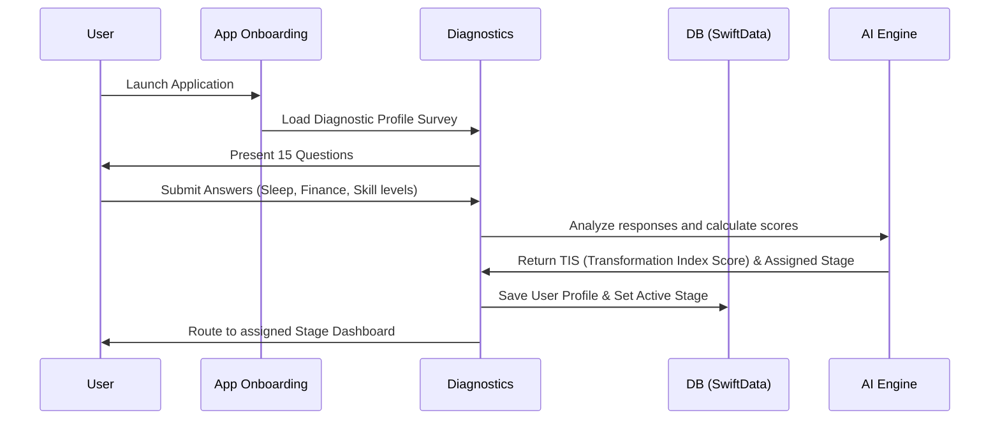
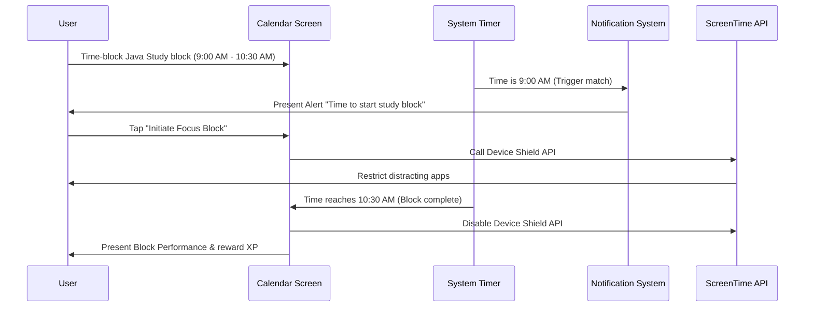
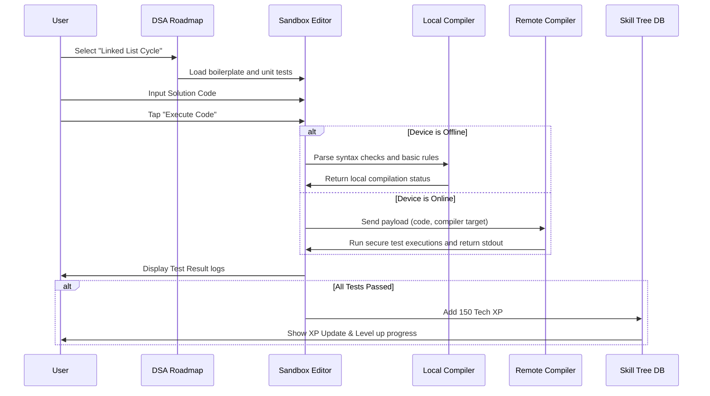
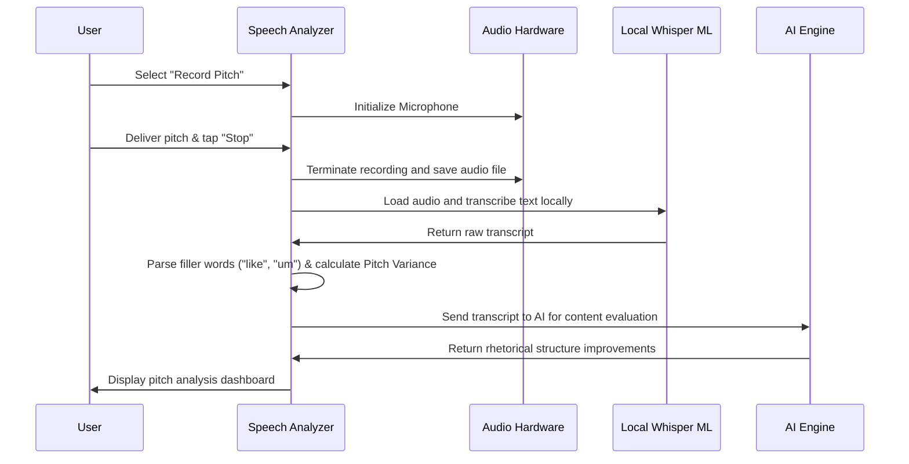

# SOFTWARE REQUIREMENTS SPECIFICATION (SRS)
## PRODUCT: ATHARVA OS (iOS Native Application)
### Version: 1.0.0
### Date: July 21, 2026

---

## 1. Executive Summary

### 1.1 Product Overview
**ATHARVA OS** is a unified, offline-first iOS application designed as a comprehensive Life Operating System. Its primary purpose is to guide individuals through a systematic, multi-stage personal and professional transformation: **Employee → Skilled Developer → Entrepreneur → CEO**. Unlike fragmented single-purpose utility apps, ATHARVA OS integrates discipline tracking, technical roadmaps, business planning, health optimization, and financial management under a single interface governed by an adaptive, multi-agent AI Advisor.

### 1.2 Core Problem Statement
The modern self-improvement and professional learning ecosystem is severely fragmented. Ambitious individuals rely on separate applications for scheduling (e.g., Google Calendar), task tracking (e.g., Todoist), coding education (e.g., LeetCode, Udemy), gym logging (e.g., Strong), financial monitoring (e.g., Copilot), and journaling (e.g., Day One). This fragmentation results in:
* **Siloed Data**: Users cannot correlate physical health (sleep debt, nutrition) with cognitive performance (typing speed, DSA problem-solving accuracy).
* **Friction & Cognitive Load**: Context-switching between multiple applications reduces completion rates and leads to high churn.
* **Lack of Progression**: Existing systems act as passive loggers rather than active mentors guiding a structured career trajectory.

### 1.3 Target Audience
* **Stage 1 (Employee)**: Junior corporate professionals seeking structure, discipline, and basic health/time management.
* **Stage 2 (Skilled Developer)**: Engineers aiming for technical mastery of core languages (Java), computer science principles (DSA), and coding efficiency.
* **Stage 3 (Entrepreneur)**: Developers and professionals transitioning to building independent products, requiring validation methodologies, financial planning, and communications training.
* **Stage 4 (CEO)**: Business founders and executives managing runway, equity allocation, high-level OKRs, team alignment, and personal leadership capacity.

---

## 2. Product Vision

### 2.1 The Transformation Funnel
The product acts as an intentional funnel. Users unlock advanced operational dashboards as they hit milestones in core disciplines and skills:

```
[ LEVEL 1: EMPLOYEE ] ──► [ LEVEL 2: DEVELOPER ] ──► [ LEVEL 3: ENTREPRENEUR ] ──► [ LEVEL 4: CEO ]
  - Habit Stacking          - Java & DSA Core         - Pitching & Rhetoric        - Equity Cap Tables
  - Health & Sleep          - Typing Practice         - Lean Canvas validation     - Cash Runway
  - Time-Block Planning     - Sandbox Coding          - Capital Allocation         - OKR dashboards
```

* **Stage 1: Employee**: Foundation building. The focus is on reducing sleep debt, establishing habits, building discipline streaks, and mastering time-blocking.
* **Stage 2: Skilled Developer**: Execution capacity. The user unlocks coding sandboxes, Java/DSA roadmaps, typing tracking, and active recall card systems.
* **Stage 3: Entrepreneur**: Market validation. The user gains access to Lean Canvas modeling, communication drills, public speaking filler word speech analysis, and personal net worth runway calculations.
* **Stage 4: CEO**: Organizational scaling. The user unlocks company cap tables, equity modeling, cash burn dashboards, and executive OKR maps.

### 2.2 Core Product Tenets
1. **iOS Native Excellence**: Leverage Apple’s native frameworks (SwiftUI, SwiftData, CloudKit, App Intents, HealthKit) to provide a premium, smooth, and battery-optimized experience.
2. **Offline-First Security**: Personal growth, financial data, and proprietary startup plans must be secure. Data is encrypted on-device and syncs via secure CloudKit pathways. Core functions must run without internet access.
3. **Adaptive AI Guidance**: The AI is not a generic text box; it is "The Board"—a panel of dedicated agents (CTO, CFO, CMO, Coach) that adapt to the user's progress level.

---

## 3. Product Goals

* **High User Retention**: Establish a 90-day retention rate of >45% by utilizing gamified RPG progression loops, streak mechanics, and dynamic dashboards.
* **Sustained Engagement**: Achieve a Daily Active User to Monthly Active User (DAU/MAU) ratio of >60% with average active sessions exceeding 20 minutes daily.
* **Successful User Transitions**: Track and guide at least 15% of active users from Stage 1 to Stage 2 within 180 days of onboarding, and 5% into Stage 3 within 360 days.
* **Consistent User Execution**: Maintain a feature completion rate of >80% for scheduled weekly time-blocks and discipline criteria.

---

## 4. Business Objectives

### 4.1 Monetization Model
ATHARVA OS operates on a freemium model:
* **Atharva Core (Free)**: Standard daily planning, local habit tracking, basic roadmap reading materials (no sandbox compiler), basic journaling, local SQLite database, and standard local reports.
* **Atharva Executive (Premium Subscription - $19.99/mo or $149.99/yr)**: Unlocks:
  * Hybrid local-remote AI Advisory Board ("The Board") with multi-agent group chats.
  * Active Swift/Java execution sandbox with automated compiler feedback.
  * Real-time automated HealthKit correlation engine.
  * Financial integration via secure Plaid API.
  * Zero-knowledge multi-device iCloud sync via CloudKit.
  * Advanced PDF weekly reports, burnout prediction alerts, and cap table projections.

### 4.2 Growth Strategy
* **Virality through Proof of Concept**: Sharing of customized "Discipline Streaks," "Type-Speed Milestones," and "Lean Canvas Sheets" directly to professional networks.
* **B2B Licensing**: Bundle packages for incubators, accelerators, and startup cohorts to manage founders' personal growth and operational runway metrics.

---

## 5. User Personas

### 5.1 Persona 1: Rohan (The Stuck Employee)
* **Age**: 23
* **Role**: QA Engineer (Manual tester at a service company)
* **Active Stage**: Stage 1 (Employee) seeking transition to Stage 2 (Skilled Developer)
* **Needs**: Structural discipline, routine morning plans, distraction blocking, and structured learning for backend engineering.
* **Frustrations**: High sleep debt (5-6 hours average), spends hours mindlessly scrolling, lacks a clear path to master Java/DSA, and fails to maintain habits.

### 5.2 Persona 2: Vikram (The Skilled Developer)
* **Age**: 26
* **Role**: Mid-Level Java Developer (Product company)
* **Active Stage**: Stage 2 (Developer) seeking transition to Stage 3 (Entrepreneur)
* **Needs**: Communication training, speech improvement, personal finance allocation, and a structured lean validation dashboard.
* **Frustrations**: Extremely technical but struggles with public speaking, uses filler words under stress, has poor budgeting despite a good salary, and does not know how to validate a SaaS business idea.

### 5.3 Persona 3: Anjali (The Solo Founder)
* **Age**: 28
* **Role**: Technical Solo Founder
* **Active Stage**: Stage 3 (Entrepreneur) seeking transition to Stage 4 (CEO)
* **Needs**: Equity allocation framework, business financial modeling, roadmap structuring, and stress reduction.
* **Frustrations**: Overwhelmed by daily operations, struggles to design equity splits for co-founders, has no dashboard linking personal sleep/health to business progress.

### 5.4 Persona 4: Atharva (The Scaling CEO)
* **Age**: 32
* **Role**: CEO of a Seed-Stage Startup (15 team members)
* **Active Stage**: Stage 4 (CEO)
* **Needs**: OKR management, cash runway indicators, public presentation voice calibration, and systematic burnout warnings.
* **Frustrations**: Suffers from frequent burnouts, manages multiple fragmented spreadsheets for business runways and employee cap tables, lacks single dashboard overview.

---

## 6. User Journey

```
[ ONBOARDING: Diagnostic Test ]
           │
           ▼
[ STAGE 1: Habituation & Foundations ]  ──(Sleep Debt < 2hrs, Discipline Streak > 14 days)──┐
           ▲                                                                               │
           └────────────────── (Streak Broken / Sleep Debt High) ──────────────────────────┼──► [ STAGE 2: Technical Execution ]
                                                                                           │      - Java Roadmap Completed
                                                                                           │      - DSA 100+ Problems Solved
                                                                                           │      - Typing Speed > 65 WPM
                                                                                           │
[ STAGE 4: CEO Operations ]  ◄──(Runway Secured, Seed Capital Modeled, Pitch Rated A)──────┴──(Savings > 6mo, Lean Canvas validated)
  - Cap Table & OKR tracking
  - Voice Pitch Trainer
  - Health & Burnout Analyzer
```

### 6.1 Diagnostic & Onboarding
1. User downloads the app and completes a mandatory 15-question life-diagnostic profiling survey (sleep, focus habits, tech skills, finance, business experience).
2. The AI calculates an initial "Transformation Index Score" (TIS) and assigns them to an initial Stage (usually Stage 1 or 2).

### 6.2 Habituation Loop (Stage 1)
1. Rohan starts his day with the **Daily Plan** screen, time-blocking his work hours and study hours.
2. He engages **Focus Mode**; the app communicates with the iOS Screen Time API to restrict social media access.
3. At night, he logs his sleep metrics (syncing with HealthKit) and completes a mood-based journal entry.
4. As he maintains a 14-day streak and reduces his sleep debt below 2 hours, the AI opens the gate to Stage 2.

### 6.3 Technical Mastery (Stage 2)
1. Rohan accesses the **Java Roadmap** and study modules directly on his iPhone.
2. He uses the **Coding Sandbox** to type Java syntax, runs dry-run algorithms, and practices typing speed.
3. After completing the Java/DSA curriculum and maintaining a typing speed of >65 WPM, he is prompted to map his first project idea, initiating Stage 3.

### 6.4 Market Validation (Stage 3)
1. Vikram opens the **Lean Canvas Generator**, filling in problem/solution parameters. The AI Advisor critiques the model and maps competitor data.
2. He uses the **Speech Analyzer** to record a 2-minute elevator pitch. The app processes the audio to count filler words and grade tone variation.
3. He logs his personal savings to calculate his personal survival runway. Once his savings exceed 6 months of expenses and his pitch score is "Grade A", he unlocks the CEO dashboard.

### 6.5 Executive Leadership (Stage 4)
1. Atharva accesses the **CEO Dashboard** to monitor startup cash runway and operational OKRs.
2. The system checks his sleep debt and active focus hours. It notes high fatigue levels and alerts him to schedule a rest day before his upcoming pitch, ensuring executive stability.

---

## 7. Complete Feature List

| ID | Feature Area | Description | Inputs | Core Processing Logic | Outputs | Stage |
|:---|:---|:---|:---|:---|:---|:---|
| F-01 | **Discipline Protocol** | Rules and boundaries engine. | Strict user rules, daily check-ins, streak status. | Calculates compliance, calculates penalty triggers when rules are broken. | Penalty notifications, XP deductions. | Stage 1+ |
| F-02 | **Daily Planning** | Time-blocking scheduling engine. | Task lists, priorities, fixed events. | Matches priority to vacant time slots via Eisenhower matrix. | Calendar block representation, push scheduling. | Stage 1+ |
| F-03 | **AI Mentor (The Board)** | Multi-agent AI consultation interface. | User prompts, journal context, financial sheets. | Routes queries to custom LLM prompt personas (CTO, CFO, Coach). | Markdown formatted advisor response. | Stage 1+ |
| F-04 | **Coding Learning** | Java & DSA curricular content. | Interactive chapters, roadmap selection. | Tracks reading progress, unlocks chapters sequentially. | Curriculum progress stats, interactive cards. | Stage 2+ |
| F-05 | **Coding Practice** | Local/Remote compiler sandbox. | User code inputs (Java/Python). | Syntactic validation, matches against unit test outputs. | Console log execution outputs, pass/fail status. | Stage 2+ |
| F-06 | **Java Roadmap** | Curated path for Java development. | Completion indicators, quiz answers. | Logic matches progress with XP, unlock requirements. | Visual tier map progress, tier level. | Stage 2+ |
| F-07 | **DSA Roadmap** | Curated path for DSA topics. | Completed exercises, complexity grades. | Validates algorithmic complexity of submission (Time/Space). | Completed DSA tracker, visual roadmap. | Stage 2+ |
| F-08 | **Typing Practice** | Input speed & mechanics testing. | Typed keystrokes, timing differences. | Compares input strings with target test values. | WPM metrics, error layouts, key lag. | Stage 2+ |
| F-09 | **Communication Skills**| Text-based negotiation & pitch helper. | User written responses to prompt scenarios. | AI scores tone, conciseness, and clarity. | Graded score card, recommended edits. | Stage 3+ |
| F-10 | **Public Speaking** | Audio record speech analyzer. | 1-3 min recorded speech files. | Processes audio to extract filler word frequencies and pitch. | Count of filler words, pitch curve, raw score. | Stage 3+ |
| F-11 | **Gym Tracking** | Progressive overload database. | Exercises, sets, reps, weight, RPE. | Calculates calculated 1-Rep Max (1RM) trends, progressive weight recommendation. | 1RM line charts, next-workout metrics. | Stage 1+ |
| F-12 | **Health Integration** | Syncing of physical indicators. | Steps, active calories, heart rate. | Reads HealthKit data, calculates metrics against baseline. | Daily health summary, energy trends. | Stage 1+ |
| F-13 | **Sleep Debt** | Target vs sleep duration tracking. | Daily sleep duration, sleep latency. | Computes rolling average sleep, tracks cumulative debt. | Sleep debt status (in hours), wind-down prompt. | Stage 1+ |
| F-14 | **Reading tracker** | Book tracking and active recall cards. | Logged books, summary entries. | Schedules recall review dates based on Anki algorithm. | Reading list milestones, flashcards. | Stage 1+ |
| F-15 | **Finance Manager** | Capital inflow/outflow ledger. | Income, expenses, assets, liabilities. | Calculates burn rates and net worth. | Net worth trend line, categorical budgets. | Stage 3+ |
| F-16 | **Savings Goals** | Runway allocation calculations. | Target monthly expenses, savings rate. | Computes survival runway in months. | Survival runway metric. | Stage 3+ |
| F-17 | **Investment Tracker** | Mock and real asset logging. | Asset values, purchase price. | Analyzes asset allocation across classes. | Allocation pie charts, ROI projections. | Stage 3+ |
| F-18 | **Startup Planning** | Dynamic Business Canvas. | Lean Canvas inputs, competitor names. | Generates canvas sections and identifies market threats. | Interactive Lean Canvas UI layout. | Stage 3+ |
| F-19 | **Company Building** | Cap table allocation calculator. | Founder names, shares, vesting rules. | Calculates equity split, models dilution scenarios. | Dilution table, vesting charts. | Stage 4 |
| F-20 | **CEO Dashboard** | Aggregated strategic metrics. | Personal TIS, business runway, OKRs. | Combines operational stats with physical metrics. | Single screen health and operational dashboard. | Stage 4 |
| F-21 | **Goal Tracking** | Multi-level OKR mapping. | OKR goals, key results, current values. | Calculates percentage progress of nested objectives. | Progress indicators, status indicators. | Stage 1+ |
| F-22 | **Vision Board** | Vision imagery & visualization cues. | Target images, custom quotes, timeline. | Plays visualization prompts tailored to images. | Image collage view, prompt overlays. | Stage 1+ |
| F-23 | **Journaling** | Reflective text journaling log. | Free text or guided journal logs. | Performs local NLP sentiment analysis. | Sentiment trend logs, cognitive distortion tags. | Stage 1+ |
| F-24 | **Mood Tracking** | Valence and arousal mapping. | Mood coordinate plots (valence/arousal). | Maps coordinates to categorical emotions. | Daily/weekly mood trends. | Stage 1+ |
| F-25 | **Focus Mode** | Focus system integration. | Focus durations, app restrictions. | Communicates with Screen Time API to restrict apps. | Locked device state, focus analytics. | Stage 1+ |
| F-26 | **Pomodoro Timer** | Work-break timer system. | Focus duration, break length, loops. | Tracks timer cycles, registers active XP. | Live ticking view, cycle report. | Stage 1+ |
| F-27 | **Calendar Engine** | Unified agenda aggregator. | Apple/Google Calendar records. | Aggregates external calendars with local time blocks. | Consolidated daily timeline screen. | Stage 1+ |
| F-28 | **Meeting Planner** | Meeting agenda optimization engine. | Attendees, duration, target agenda. | Calculates estimated dollar cost of meeting. | Dollar cost warning, structured action notes. | Stage 4 |
| F-29 | **Habit Tracker** | Trigger-based habit loops. | Habituated events, cues, rewards. | Evaluates execution streaks. | Streak metrics, habit grid logs. | Stage 1+ |
| F-30 | **XP Leveling System** | Gamified leveling mechanics. | Activity completed logs. | Evaluates XP gained and updates character stats. | Level-up indicators, stat points. | Stage 1+ |
| F-31 | **Analytics Engine** | Cross-domain analytics generator. | App action logs, health data, code logs. | Runs correlation math (e.g. sleep vs focus time). | Multi-dimensional correlation graphs. | Stage 1+ |
| F-32 | **Notification System**| Push notification router. | System triggers, calendar alarms. | Routes alerts based on active user state (Focus/Sleep). | Scheduled, batched push notifications. | Stage 1+ |
| F-33 | **Weekly Reports** | PDF report generator. | Seven days of data records. | Synthesizes logs into performance reports. | Exportable PDF performance reports. | Stage 1+ |
| F-34 | **AI Chat Interface** | Conversational AI wrapper. | Chat input strings. | Processes text via active prompt structure. | Streamed markdown response messages. | Stage 1+ |
| F-35 | **Voice Notes** | Transcription and sorting manager. | Recorded audio files. | Processes audio using speech-to-text models. | Text transcripts, automatic category tags. | Stage 1+ |
| F-36 | **Secure Vault** | Password and document storage. | Passwords, cap files, sensitive notes. | Encrypts files using local AES-GCM-256 keys. | Encrypted file lists, lock/unlock states. | Stage 3+ |
| F-37 | **Settings Management**| Configuration dashboard. | Notification toggles, API keys. | Saves app configurations to standard storage. | Configured preferences state. | Stage 1+ |
| F-38 | **Cloud Sync** | Data state synchronizer. | Local SwiftData records. | Uploads/downloads records with CloudKit databases. | Sync status indicators, resolved sync conflicts. | Stage 1+ |

---

## 8. Functional Requirements

### 8.1 Module 1: Discipline & Habits System (F-01, F-29)
* **FR-1.1**: The system must allow users to define a maximum of 5 "Iron Rules" (non-negotiable habits) per day.
* **FR-1.2**: The system must prompt a check-in interface at a user-defined evening time (default 9:00 PM).
* **FR-1.3**: If a user fails an "Iron Rule," the system must deduct 100 XP from their character profile.
* **FR-1.4**: If a rule is broken, the system must trigger a penalty action (e.g., locking access to entertainment applications for the following morning via the iOS Screen Time API).
* **FR-1.5**: The system must maintain a count of consecutive compliant days (streak) and apply an XP multiplier ($1.0 + (\text{streak} \times 0.05)$, capped at $2.0$).

### 8.2 Module 2: Daily Time-Block Planning & Calendar (F-02, F-27)
* **FR-2.1**: The system must support importing external calendars via EventKit (Apple Calendar) and Google Calendar API.
* **FR-2.2**: The system must allow users to create 30-minute time blocks for work, study, physical training, and reflection.
* **FR-2.3**: The system must automatically rank user tasks using the Eisenhower Matrix rules:
  * Quadrant 1: Urgent & Important (Scheduled for immediate morning blocks).
  * Quadrant 2: Important, Not Urgent (Scheduled for midday focus blocks).
  * Quadrant 3: Urgent, Not Important (Scheduled for late afternoon delegation/batching).
  * Quadrant 4: Not Urgent, Not Important (Archived or hidden).
* **FR-2.4**: When a time block matches the current system time, the app must send a local push notification asking the user to initiate the block.

### 8.3 Module 3: Interactive Coding Sandbox & Roadmap (F-04, F-05, F-06, F-07)
* **FR-3.1**: The system must display a hierarchical Java roadmap covering 5 tiers: Fundamentals, Advanced Concurrency, Spring Framework, Performance Tuning, and Architecture.
* **FR-3.2**: The system must contain an on-device text editor with syntax highlighting for Java and Python.
* **FR-3.3**: The system must run user-submitted code in a secure sandbox wrapper:
  * For offline runs: Evaluates basic syntax locally on-device.
  * For online runs: Sends code to a sandboxed secure remote server, limits execution to 3.0 seconds, and captures standard output and error logs.
* **FR-3.4**: The system must parse coding progress and unlock corresponding theoretical assessments and DSA challenges.
* **FR-3.5**: The system must include an active recall flashcard interface operating on a modified SuperMemo-2 (SM2) spaced repetition algorithm.

### 8.4 Module 4: Speech Analyzer (F-10)
* **FR-4.1**: The system must access the microphone hardware on user request to capture 1-3 minutes of audio.
* **FR-4.2**: The system must transcribe the audio locally using the iOS Speech Framework or a local Whisper CoreML model.
* **FR-4.3**: The transcription engine must identify and count filler words: "uh", "um", "like", "so", "basically", and "actually".
* **FR-4.4**: The system must calculate a Pitch Variance score by tracking the fundamental frequency ($F_0$) variations in the audio file.
* **FR-4.5**: The output screen must show: WPM rate, count of filler words, Pitch Variance score, and an overall clarity grade (A to F).

### 8.5 Module 5: CEO Dashboard & Cap Table Calculator (F-19, F-20)
* **FR-5.1**: The system must display business operational runway calculated using:
  $$\text{Runway (Months)} = \frac{\text{Current Cash Reserves}}{\text{Monthly Burn Rate}}$$
* **FR-5.2**: The Cap Table component must process inputs for founder/investor name, share count, option pool reserve, and vesting schedule (cliff and duration).
* **FR-5.3**: The system must calculate and output: percentage ownership, post-money valuation, diluted shares, and vested/unvested balances.
* **FR-5.4**: The dashboard must merge personal health data (sleep debt, workout count) with business indicators to display a "Company Health Index" score.

### 8.6 Module 6: Lean Canvas & Startup Planning (F-18)
* **FR-6.1**: The system must provide editable fields for the 9 blocks of the Lean Canvas model.
* **FR-6.2**: The system must send canvas inputs to the AI module to request a logic critique.
* **FR-6.3**: The AI must return: identified business assumptions, market risks, and suggested test experiments.
* **FR-6.4**: The system must support exporting the completed Lean Canvas as a styled PDF document.

### 8.7 Module 7: HealthKit Sleep & Workout Sync (F-12, F-13)
* **FR-7.1**: The system must query Apple HealthKit for sleep duration data (Deep, REM, Core phases) and workout logs.
* **FR-7.2**: The system must calculate Sleep Debt:
  $$\text{Sleep Debt} = \sum_{i=1}^{7} (8.0 - \text{Sleep Hours}_i)$$
* **FR-7.3**: If Sleep Debt exceeds 10.0 hours, the system must show a prominent warning on the Daily Planner screen.

### 8.8 Module 8: Finance & Net Worth Tracker (F-15, F-16, F-17)
* **FR-8.1**: The system must allow users to log financial assets, liabilities, recurring income, and expenses.
* **FR-8.2**: The system must calculate Net Worth:
  $$\text{Net Worth} = \text{Total Assets} - \text{Total Liabilities}$$
* **FR-8.3**: The system must compute personal survival runway based on average monthly burn rate.

### 8.9 Module 9: The AI Board Chat (F-03, F-34)
* **FR-9.1**: The system must present a group chat option containing 4 default AI advisors: CTO, CFO, CMO, and Coach.
* **FR-9.2**: The user must be able to address individual advisors or prompt a joint discussion.
* **FR-9.3**: The system must pass user journal sentiment, sleep debt, and operational runway metrics as background system context.

### 8.10 Module 10: Secure Vault (F-36)
* **FR-10.1**: The system must create a secure, password-locked area within the local storage directory.
* **FR-10.2**: All content saved in the vault must be encrypted using AES-GCM-256 encryption.
* **FR-10.3**: Encryption keys must be generated using PBKDF2 with salt, stored safely within the iOS Keychain, and backed by the Secure Enclave.
* **FR-10.4**: The system must prompt FaceID or TouchID authentication before exposing vault directory paths.

---

## 9. Non-Functional Requirements

### 9.1 Security & Privacy
* **NFR-1.1 (Encryption)**: All SQLite/SwiftData files containing financial, journal, or secure vault details must be encrypted on-device at rest using hardware keys derived via the Secure Enclave.
* **NFR-1.2 (Zero-Knowledge Sync)**: iCloud sync data must be encrypted with user-specific keys before upload. Apple or third-party servers must not be able to decrypt personal data.
* **NFR-1.3 (Biometrics)**: Require FaceID/TouchID verification after 5 minutes of app inactivity.

### 9.2 Reliability & Sync
* **NFR-2.1 (Offline Operation)**: All features, including coding roadmaps, typing analysis, speech algorithms, sleep metrics, and vaults, must work without active network access.
* **NFR-2.2 (Sync Conflicts)**: When network access returns, CloudKit sync must resolve conflicts using vector clocks, prioritizing the device with the most recent user action.

### 9.3 Compatibility
* **NFR-3.1 (OS Version)**: Supported on devices running iOS 17.0 and higher.
* **NFR-3.2 (Device Support)**: Optimized for iPhone 13, 14, 15, and 16 lines (including Pro/Max models).
* **NFR-3.3 (Frameworks)**: Built with SwiftUI and SwiftData.

### 9.4 Compliance
* **NFR-4.1 (Privacy Compliance)**: Adhere to GDPR and California Consumer Privacy Act (CCPA) standards. Data must be exportable as JSON and deleteable locally.
* **NFR-4.2 (App Store Review Guidelines)**: Ensure full compliance with Guideline 5.1.1 (Data Collection and Storage) and Guideline 2.5.2 (External Executables - execution of code within the local compiler sandbox must remain limited to educational execution without altering system states).

---

## 10. User Stories

1. **US-1 (Discipline Setup)**: *As Rohan*, I want to set up an Iron Rule to study Java for 1 hour every morning at 6:00 AM, *so that* I can transition from Stage 1 to Stage 2.
2. **US-2 (AI Board Critique)**: *As Vikram*, I want to open a group chat with my virtual CTO and CMO, *so that* I can receive design feedback on my Lean Canvas startup plan.
3. **US-3 (Speech Feedback)**: *As Vikram*, I want to record my business pitch inside the Speech Analyzer, *so that* I can track my filler words and speaking speed.
4. **US-4 (Focus Block Execution)**: *As Rohan*, I want to start my morning Java study time-block, *so that* my device enters Focus Mode and blocks social media.
5. **US-5 (Health Metrics Correlation)**: *As Atharva*, I want the system to correlate my high sleep debt with my low focus time this week, *so that* I can receive warning logs for potential burnout.
6. **US-6 (Coding Practice Evaluation)**: *As Rohan*, I want to practice DSA array manipulation in the on-device compiler sandbox, *so that* I can verify my code correctness.
7. **US-7 (Cap Table Modeling)**: *As Anjali*, I want to input potential seed investor shares, *so that* I can calculate founder dilution prior to signing the term sheet.
8. **US-8 (Runway Warning)**: *As Anjali*, I want to check my startup cash runway indicators, *so that* I know how many months of operational capital remain.
9. **US-9 (Secure Document Lock)**: *As Vikram*, I want to save my pitch deck and business financials in the Secure Vault, *so that* my private data is protected behind biometric security.
10. **US-10 (Offline Sync)**: *As Rohan*, I want to write journal entries while offline on a flight, *so that* they save locally and sync to iCloud when I reconnect.
11. **US-11 (Typing Assessment)**: *As Rohan*, I want to complete a typing drill, *so that* I can log my WPM speed progress and key lag metrics.
12. **US-12 (Sleep Debt Review)**: *As Atharva*, I want to check my cumulative sleep debt chart, *so that* I can adjust my evening wind-down alarm times.
13. **US-13 (Dynamic Roadmaps)**: *As Rohan*, I want to view my Java Roadmap, *so that* I can see which OOP lessons are locked until I complete basic syntax.
14. **US-14 (Expense Logging)**: *As Vikram*, I want to log my monthly apartment rent and living expenses, *so that* the system updates my survival runway calculations.
15. **US-15 (XP Level Up)**: *As Rohan*, I want to complete a DSA graph search challenge, *so that* I can earn 150 Intelligence XP and level up my Developer character stats.

---

## 11. Acceptance Criteria

### 11.1 AC-1 (User Story 1: Discipline Setup)
```gherkin
Given the user is on Stage 1 (Employee) dashboard
When the user taps "Define Iron Rule"
And inputs "Study Java"
And sets the schedule to "Daily, 6:00 AM"
And taps "Save"
Then the system saves the rule to the local database
And displays the new rule on the Daily Planner screen
And schedules a local notification for 6:00 AM daily.
```

### 11.2 AC-2 (User Story 2: AI Board Critique)
```gherkin
Given the user has completed a Lean Canvas model
When the user navigates to "The Board" group chat
And selects "CTO" and "CMO" as active advisors
And inputs "Critique my Lean Canvas target solution"
And taps "Send"
Then the system combines the prompt with the saved Lean Canvas JSON context
And sends the payload to the AI endpoint
And streams the response formatting markdown comments from both CTO and CMO personas.
```

### 11.3 AC-3 (User Story 3: Speech Feedback)
```gherkin
Given the user is on the Speech Analyzer screen
When the user taps "Record Speech"
And records audio for 90 seconds
And taps "Complete Analysis"
Then the system processes the audio data locally
And calculates a pitch variance map
And counts occurrences of "uh", "um", "like", "so"
And displays a report containing: WPM count, Filler Count, and a Pitch Variance chart.
```

### 11.4 AC-4 (User Story 4: Focus Block Execution)
```gherkin
Given the user has a time-block scheduled for 9:00 AM
When the system time reaches 9:00 AM
And the user responds to the prompt by tapping "Initiate Focus Block"
Then the system triggers the iOS Screen Time API shield
And changes the local UI to Focus Mode
And locks access to apps categorized under "Social Media" and "Entertainment".
```

### 11.5 AC-5 (User Story 5: Health Metrics Correlation)
```gherkin
Given the user has 12 hours of Sleep Debt logged in HealthKit
And the focus tracker records less than 2 hours of daily study for 3 consecutive days
When the user opens the app
Then the system displays a "Burnout Risk Level: Critical" dashboard banner
And lists recommendations to resolve sleep debt and restrict work.
```

### 11.6 AC-6 (User Story 6: Coding Practice Evaluation)
```gherkin
Given the user is in the Coding Sandbox
When the user enters Java code for "binary search"
And taps "Execute Code"
Then the sandbox runs the execution pipeline
And compares standard output against the test assertion suite
And displays "Execution Successful: All Tests Passed" in green text.
```

### 11.7 AC-7 (User Story 7: Cap Table Modeling)
```gherkin
Given the user is on the Cap Table screen
When the user inputs "Investor B", "200,000 shares", and "No vesting"
And taps "Calculate Dilution"
Then the system updates the dilution table calculations
And recalculates founder equity percentages
And displays a diluted shares distribution pie chart.
```

### 11.8 AC-8 (User Story 8: Runway Warning)
```gherkin
Given the user is on the CEO Dashboard
When the cash balance decreases to $50,000
And the monthly burn rate is calculated at $15,000
Then the system flags the Runway indicator red
And displays the text "Runway: 3.3 Months - Funding Action Required".
```

### 11.9 AC-9 (User Story 9: Secure Document Lock)
```gherkin
Given the user wants to access the Secure Vault
When the user clicks the "Vault" navigation item
Then the system triggers an OS FaceID biometric prompt
And only shows the folder structure and file lists if authentication returns true.
```

### 11.10 AC-10 (User Story 10: Offline Sync)
```gherkin
Given the device is in Airplane Mode
When the user saves a new journal entry
Then the system updates the local database state
And labels the record metadata as "Sync State: Pending"
And pushes the entry to the CloudKit sync queue to resolve on network reconnection.
```

### 11.11 AC-11 (User Story 11: Typing Assessment)
```gherkin
Given the user is on the Typing Practice screen
When the user types the presented sentence string
Then the system records exact keyboard keystroke times
And measures differences between characters
And displays final WPM, error rates, and identifies slowest characters.
```

### 11.12 AC-12 (User Story 12: Sleep Debt Review)
```gherkin
Given the user has enabled Apple Health integration
When the user loads the Sleep dashboard
Then the system queries HealthKit for the past 7 nights of sleep data
And updates the cumulative Sleep Debt calculation
And displays a rolling 7-day sleep hours bar chart.
```

### 11.13 AC-13 (User Story 13: Dynamic Roadmaps)
```gherkin
Given the user has not completed "Java Basic Syntax"
When the user views the "Java Advanced Concurrency" node on the roadmap screen
Then the node is grayed out
And displays a lock icon
And prevents selection or module loading.
```

### 11.14 AC-14 (User Story 14: Expense Logging)
```gherkin
Given the user is on the Finance screen
When the user adds an expense of "$1200" categorized as "Rent"
Then the system reduces the calculated Net Worth estimate
And recalculates the personal survival runway
And updates the monthly budget progress visualization.
```

### 11.15 AC-15 (User Story 15: XP Level Up)
```gherkin
Given the user is at Level 4 (Developer) with 950/1000 Intelligence XP
When the user completes a DSA coding exercise worth 100 XP
Then the system increments the Intelligence XP value to 1050
And updates the character profile level to 5
And pops up a "Level Up!" celebratory graphic.
```

---

## 12. Navigation Structure

```
[ ROOT NAVIGATION (SwiftUI TabView) ]
 ├── TAB 1: Core Dashboard (Dynamic depending on Stage Level)
 │    ├── Stage 1: Daily Focus Plan & Habits Grid
 │    ├── Stage 2: Coding Sandbox & Active Roadmap
 │    ├── Stage 3: Pitch Analyzer & Savings Runway
 │    └── Stage 4: OKRs, Company Runway & Cap Table
 ├── TAB 2: AI Board Room (Advisory Panel Chat)
 │    ├── Group Consultation View
 │    └── Individual Advisor Threads (CTO, CMO, CFO, Coach)
 ├── TAB 3: Skill Tree (XP, RPG stats, Level metrics)
 │    ├── Discipline Tree (Sleep, gym, routine stats)
 │    ├── Tech Tree (Java milestones, DSA progress)
 │    ├── Business Tree (Lean validations, budget markers)
 │    └── Leadership Tree (Clarity scoring, speech performance)
 ├── TAB 4: Secure Vault (Biometric locked data storage)
 │    ├── Encrypted Note Editor
 │    └── PDF Document Safe
 └── TAB 5: Core Settings & Integrations
      ├── Profile & Stage Diagnostics
      ├── HealthKit & EventKit Access
      └── CloudKit Sync Log
```

---

## 13. Screen Inventory

### 13.1 Screen Summary Table
| Screen ID | Screen Name | Layout Style | Core Components | Interactive Elements | Screen States |
|:---|:---|:---|:---|:---|:---|
| SCR-01 | **Onboarding Diagnostic** | Full-Screen Wizard | Multi-choice progress deck. | Next button, radio buttons. | Init, In-Progress. |
| SCR-02 | **Stage 1: Foundation Dashboard**| Grid-based Tab View | Habits list, sleep debt widget, schedule blocks. | Habit check-in checkboxes, Focus triggers. | Empty (no habits), Populated. |
| SCR-03 | **Stage 2: Developer Dashboard** | Split View | Active roadmap path, sandbox snippet preview, WPM stats. | Launch coding compiler, practice typing. | Load error, Populated. |
| SCR-04 | **Stage 3: Entrepreneur Dashboard**| Card List Layout | Lean Canvas progress, Pitch voice widget, Net Worth. | Pitch recording trigger, edit canvas. | Empty Canvas, Saved Canvas. |
| SCR-05 | **Stage 4: CEO Dashboard** | executive KPI Grid | Runway status, OKR charts, team metrics, burnout flags. | Recalculate runway, edit OKR. | Normal, Critical Warnings. |
| SCR-06 | **AI Board Room Group Chat** | Chat Interface | Thread messages, advisor selectors. | Input field, attach file, avatar filters. | Loading history, Stream. |
| SCR-07 | **CTO Console** | Dialogue screen | Technical log notes, Java code feedback. | Request design review, clear logs. | Populated history. |
| SCR-08 | **CFO Console** | Financial Chat Screen| Cash sheets, investment allocation context. | Auto-balance simulation, send chat. | Populated history. |
| SCR-09 | **CMO Console** | Marketing Chat Screen | Competitor data lists, go-to-market summaries. | Analyze website, prompt pitch critique. | Populated history. |
| SCR-10 | **Coach Console** | Dialogue Room | Mood histories, stress patterns. | Start CBT journaling loop, chat. | Populated history. |
| SCR-11 | **Java Roadmap Map** | Vector Tree | Roadmap node diagrams. | Node button selections, details sheet. | Locked, Active, Completed. |
| SCR-12 | **Coding Sandbox Editor** | Code Editor | Syntax theme picker, code text space, output console. | Run, check tests, pick language. | Idle, Compiling, Success. |
| SCR-13 | **DSA Curriculum Deck** | List Layout | Algorithm modules, problem indices. | Select problem, view algorithm. | Unlocked list. |
| SCR-14 | **Typing Practice Arena** | Game Canvas | Text target string, typing cursor. | Keystroke listener, restart key. | Active, Result screen. |
| SCR-15 | **Speech Performance Analyzer**| Audio Graph View | Voice wave capture, pitch track lines, filler counts. | Record, pause, analyze speaker. | Recording, Analysing, Done. |
| SCR-16 | **Gym Log Details** | Sheet | Weights, reps, sets, RPE list. | Log set, exercise search field. | Empty set, Active workout. |
| SCR-17 | **Active Recall Flashcards** | Carousel Deck | Flashcard, answer options, rating buttons. | Flip card, rate retention quality. | Card front, Card back. |
| SCR-18 | **Finance Manager Ledger** | Linear Ledger | Transactions list, asset category values. | Add item, link Plaid provider. | Linked, Offline manual. |
| SCR-19 | **Lean Canvas Builder** | 9-Box Grid | Interactive segment layout. | Tap section, save draft. | Empty, Partial, Full. |
| SCR-20 | **Cap Table dilute Simulator** | Table Layout | Shareholders list, valuation input. | dilutes shares, change round size. | Table calculations. |
| SCR-21 | **Goal Map OKRs** | Nested list | OKR objectives tree. | Add Key Result, toggle progress. | Active OKR, Closed. |
| SCR-22 | **CBT Journal Editor** | Text Form | Journal text space, distortion analysis list. | Check sentiment, save entry. | Empty input, Analyzed. |
| SCR-23 | **Secure Vault Files** | Directory Tree | Locked folders list, files. | Biometric trigger, add document. | Locked, Unlocked. |
| SCR-24 | **Settings & Connections** | List view | Integration buttons (HealthKit, CloudKit, APIs). | Reset, sync toggles. | Connected, Denied. |

---

## 14. User Flows

### 14.1 Diagnostic Onboarding & Evaluation Flow


### 14.2 Daily Time-Block & Focus Flow


### 14.3 Coding Practice Loop


### 14.4 Speech Recording & Rhetoric Analysis Flow


### 14.5 Startup Building to OKR Planning Flow
1. User enters Stage 3 and accesses **Lean Canvas Builder** (SCR-19) to design their startup value proposition.
2. The user submits the canvas to the **AI Board** (SCR-06) for feedback from the virtual CTO and CMO.
3. Upon validation, the user transitions to Stage 4 and creates a **Company Profile** within the **Cap Table dilution Simulator** (SCR-20).
4. The user sets up high-level **Goal Map OKRs** (SCR-21) to track hiring targets and runway extensions.
5. The CEO Dashboard aggregates all active indicators, displaying company runway status and personal health metrics.

---

## 15. Roles & Permissions

### 15.1 System Subscription Tiers
1. **Standard Tier (Free)**:
   * Access to local data storage (SQLite/SwiftData).
   * Manual entry of habits, schedules, workouts, and financial ledgers.
   * Read-only access to Java & DSA roadmaps.
   * 3 basic AI queries per 24 hours.
2. **Executive Tier (Premium)**:
   * Full access to coding sandboxes with compile capabilities.
   * Multi-device iCloud sync with automatic conflict resolution.
   * Automated Apple HealthKit sync and correlation insights.
   * Integration with Plaid for direct budget tracking.
   * Unlimited consultation with "The Board" group chat.

### 15.2 OS Data Access Permissions
* **HealthKit Read Permission**: Required to sync sleep duration, heart rate, and workouts.
* **Microphone Permission**: Required for the Speech Analyzer to record pitches.
* **Screen Time API Permission**: Required for Focus Mode to restrict application usage.
* **Notifications Permission**: Required for calendar reminders, discipline prompts, and streak notifications.

---

## 16. AI Behavior & Architecture

### 16.1 Hybrid Processing Model
ATHARVA OS uses a hybrid processing scheme:
* **Local Processing (CoreML/On-Device APIs)**:
  * Speech-to-text transcription via Whisper CoreML model.
  * Sentiment analysis and basic cognitive distortion tag extraction using NaturalLanguage framework.
  * Text prediction for spelling and typing indicators.
* **Remote Processing (GPT-4o/Gemini 1.5 Pro via secure proxy)**:
  * Complex strategic advisory queries (CTO, CFO, CMO, Coach).
  * Critiques of Lean Canvas drafts.
  * Complex code evaluations that exceed local compiler sandbox capabilities.

### 16.2 Prompt Architectures & Persona Guidelines
Each virtual board advisor operates under a specialized system instruction template:

```
[ SYSTEM PROMPT: THE BOARD ADVISORS ]
  ├── CTO (Persona: Analytical, direct, focused on system design patterns)
  ├── CFO (Persona: Conservative, numbers-driven, prioritizes runway metrics)
  ├── CMO (Persona: Market-focused, customer-driven, validates value props)
  └── Coach (Persona: Empathetic, supportive, utilizes CBT methodologies)
```

* **CTO**: "You are the virtual CTO of ATHARVA OS. Your tone is analytical, direct, and structured. Evaluate all user ideas for technical feasibility, architecture constraints, and codebase quality. Focus on Java/DSA patterns and scaling problems."
* **CFO**: "You are the virtual CFO of ATHARVA OS. Your tone is conservative, risk-averse, and highly focused on cash preservation. Challenge users on operational costs, customer acquisition costs (CAC), and runway extension."
* **CMO**: "You are the virtual CMO of ATHARVA OS. Your tone is market-focused and strategic. Analyze user value propositions, channels, user feedback, and marketing campaigns. Focus on user acquisition and retention metrics."
* **Coach**: "You are the virtual Executive Coach of ATHARVA OS. Your tone is empathetic and supportive, yet firm on discipline. Use Cognitive Behavioral Therapy (CBT) methods to address user blockages, anxiety, burnout risk, and habit slips."

### 16.3 Operational Parameters
* **Latency SLA**: Remote AI requests must return the first token stream in under 800 milliseconds.
* **Data Sanitization**: Before uploading prompts, remove personally identifying information (names, email addresses, specific phone numbers) via on-device regex replacement blocks.

---

## 17. Gamification Strategy

### 17.1 RPG Character Statistics
The user's avatar progress is tracked across 4 primary attributes:
* **Strength (STR)**: Increased by workout completion, sleep compliance (>7.5 hours), and meeting hydration metrics.
* **Intelligence (INT)**: Increased by completing DSA challenges, code sandboxes, and reading book chapters.
* **Charisma (CHA)**: Increased by completing speech analyzer recordings and communication negotiation scenarios.
* **Fortune (FOR)**: Increased by logging savings, tracking investment allocations, and keeping budget balances.

### 17.2 XP Progression Mechanics
The XP required to level up follows the equation:
$$\text{XP Required} = 100 \times (\text{Level})^{1.5}$$

XP values awarded for typical tasks:
* Complete scheduled Focus block: $50\text{ XP}$ (INT/STR).
* Solve Medium DSA challenge: $150\text{ XP}$ (INT).
* Pass Pitch record with Grade A: $200\text{ XP}$ (CHA).
* Daily Habit compliance: $10\text{ XP}$ per habit.
* Iron Rule compliance: $50\text{ XP}$ (STR).

### 17.3 Loss Aversion & Penalties
* **The Decay Rule**: If an Iron Rule is broken, the user enters a "Flipped State" where they lose 20 XP every 4 hours until they complete a restoration activity.
* **Streak Modifiers**: Streaks multiply the XP output of tasks. Breaking a streak drops the multiplier back to $1.0\times$.

---

## 18. Notification Strategy

### 18.1 Notification Priority Matrix
| Priority Level | Trigger Event | Mechanism | Delivery Time | Focus Mode Behavior |
|:---|:---|:---|:---|:---|
| **Critical** | Heart rate threshold alerts, critical database sync corruption. | Local Push Alert with High-Priority Sound. | Immediate. | Bypass Focus, sound alert. |
| **High** | Iron Rule check-in reminder, Daily Planner block transitions. | Local push alert. | Scheduled on time. | Queue inside Focus, sound on exit. |
| **Medium** | Weekly performance report ready, habit suggestions. | Remote push notification. | 6:00 PM (Local user time). | Silent batch delivery. |
| **Low** | Level Up milestones, skill tree points available. | In-app notification card. | During active session. | No external alert. |

### 18.2 Smart Batching
The app groups minor announcements (e.g., XP earned, book milestones) into a "Daily Digest" delivery block sent at 8:00 AM and 8:00 PM local time to prevent user notification fatigue.

---

## 19. Offline Functionality

### 19.1 Architecture & Core Data
The system is built as an offline-first tool utilizing **SwiftData** with an underlying **SQLite** storage engine. All records (tasks, workouts, balances, code logs, journal entries) are written to the local database immediately.

```
[ LOCAL USER ACTION ] ──► [ SwiftData (Local SQLite) ] ──► [ Sync Queue Engine ]
                                                                   │
    ┌─────────────────────────── Network Status ───────────────────┤
    ▼ (Offline)                                                    ▼ (Online)
[ Queue Pending Data ]                                     [ CloudKit Cloud Sync ]
```

### 19.2 Local Storage Fallbacks
* **Offline Audio Processing**: Uses the native iOS CoreML compiler execution of the Whisper Small weights to perform transcription without internet dependencies.
* **Sync States**: Every record in the database includes a `sync_state` attribute with values:
  * `0`: Synced.
  * `1`: Pending Creation.
  * `2`: Pending Update.
  * `3`: Pending Deletion.

---

## 20. Cloud Synchronization Strategy

### 20.1 Architecture
Data synchronization between client devices (iPhone, iPad, Mac) uses Apple’s secure **iCloud CloudKit** servers. The SwiftData context maps directly to a CloudKit container using Private Database partitions, ensuring complete data ownership for the user.

### 20.2 Conflict Resolution Logic
When resolving discrepancies between local database records and CloudKit server records:
1. **Vector Clocks**: Every record contains an integer counter incremented with every change. The record with the higher clock counter is selected.
2. **Timestamp Fallback**: If vector clocks are equal, the system selects the record with the most recent ISO-8601 timestamp.
3. **Complex Merges**: For text files (such as Lean Canvas fields or detailed journal text blocks), the system runs a text diff-match-patch merge. If merging fails, it preserves both copies as alternative drafts and alerts the user on the next app launch.

---

## 21. Security Requirements

### 21.1 Cryptographic Implementation
* **Encryption Standards**: Encrypted files in the Secure Vault use **AES-256-GCM** encryption.
* **Key Derivation**: Keys are derived from user passphrases using **PBKDF2** with a minimum iteration count of 100,000, salted with a 128-bit cryptographically secure random value.
* **Secure Storage**: Derived keys and user session keys are stored in the iOS Keychain system. Key authorization rules specify `kSecAttrAccessibleAfterFirstUnlockThisDeviceOnly` to prevent transfer of credentials off the device.

### 21.2 Biometric Access
The user must authenticate using FaceID or TouchID before access to SCR-23 (Secure Vault) or SCR-05 (CEO Finance Dashboards) is allowed. If biometric authentication fails twice, the system prompts for the user's master passcode.

---

## 22. Performance Requirements

* **UI Frame Rate**: Achieve 120 FPS rendering on ProMotion screens. Transition animations and scroll views must run without stuttering.
* **Launch Time**: The application must reach an interactive state within 1.5 seconds of execution on devices running iOS 17+.
* **Memory Footprint**: App active RAM allocation must remain below 150MB during standard dashboard operations, and below 350MB during local compilation or on-device speech transcription.
* **Battery Consumption**: Background operations (such as HealthKit sync or background sync tasks) must consume less than 2% of the active device charge over a 12-hour period.

---

## 23. Accessibility Requirements

* **Dynamic Type**: Fully support iOS Dynamic Type, allowing labels, text fields, and descriptions to scale based on user system settings without breaking screen structures.
* **VoiceOver**: All interactive controls (buttons, input boxes, checkmarks) must have descriptive `accessibilityLabel` attributes (e.g., "Initiate study block button", "Log workout checkmark").
* **Color Contrast**: Text and interactive UI elements must adhere to WCAG 2.1 AA guidelines, maintaining a minimum contrast ratio of 4.5:1 against their backgrounds.
* **Target Size**: All touch targets must measure at least $44 \times 44$ points to ensure accessibility for users with limited motor control.

---

## 24. Error Handling

### 24.1 System Error Codes & UX Strategies
| Error Code | Category | Cause | User Interface Action | Recovery Strategy |
|:---|:---|:---|:---|:---|
| **ERR-1001** | Database | SwiftData write failure / disk full. | Display a persistent banner warning "Device storage is full." | Clear local cache directories. |
| **ERR-2002** | Network | CloudKit endpoint unreachable. | Show a silent status indicator: "Offline mode active." | Store changes locally and retry when connection status updates. |
| **ERR-3003** | AI API | OpenAI/Gemini rate limits exceeded. | Display modal warning "Advisor busy. Retrying in 10s." | Implement exponential backoff for API calls. |
| **ERR-4004** | Speech | Microphones inaccessible / permissions blocked. | Alert modal "Microphone permission required." | Direct the user to the iOS Settings app to grant permissions. |
| **ERR-5050** | Sync | Conflict resolution counter failure. | Notify user: "Draft conflict detected. Choose version." | Present side-by-side selection tool. |

---

## 25. Future Scalability

* **Multi-Platform Support**: Keep views modular using SwiftUI to support easy deployment on iPadOS and macOS Catalyst.
* **watchOS Companion App**: Design the database layer to sync with a watchOS companion app focused on active gym tracking and quick habit completion checks.
* **Integrations Pipeline**: Standardize developer interfaces to support future connections with external tools like GitHub (for automatic dev metrics sync), Plaid (automated finance tracking), and Linear (project ticket syncing).

---

## 26. Risks & Assumptions

* **App Store Rejection Risk**: Apple maintains strict rules regarding on-device compilation of code. The compilation sandboxes must remain isolated and purely educational to comply with Guideline 2.5.2.
* **AI Cost Scaling**: Relying on remote LLM endpoints for group consulting can incur high costs. Subscription pricing tiers must cover maximum average prompt volumes.
* **Speech Analysis Accuracy**: Background ambient noise can degrade speech analysis metrics. The user experience must design for variations in transcription accuracy depending on recording environments.
* **Storage Footprint**: Keeping local LLM models on the device requires substantial storage. The app should download models on-demand to keep initial app downloads under 100MB.

---

## 27. Success Metrics

* **Transformation Index Score (TIS)**: A composite progress index derived from:
  $$\text{TIS} = 0.3 \times \text{Discipline Streak} + 0.3 \times \text{Roadmap Progress} + 0.2 \times \text{Runway (Months)} + 0.2 \times \text{Health Score}$$
* **Retention Metrics**: Maintain a Monthly Active User (MAU) cohort retention curve above 45% at Day 90.
* **Engagement Milestones**: Maintain an average of 4 completed Focus Blocks per active user weekly.
* **App Stability**: Keep crash-free user sessions above 99.9%.
